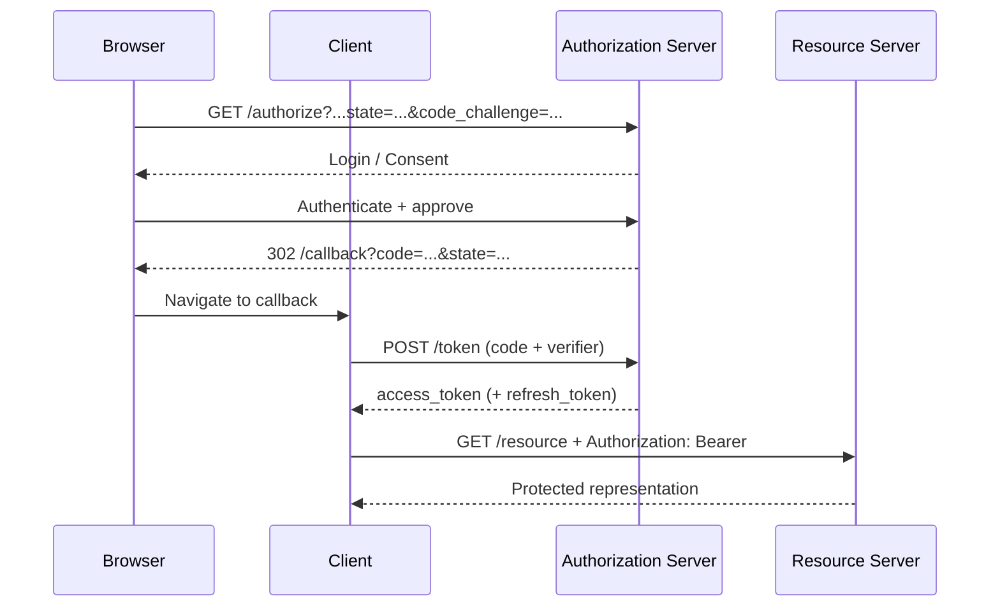

# 01 — HTTP & REST Basics

> **Prerequisite objective:** Build the HTTP mental model required to understand OAuth 2.0 authorization requests, token endpoints, redirects, protected APIs, and security controls.

---

## Learning objectives

By the end of this chapter, you should be able to:

- Explain HTTP request/response semantics and statelessness.
- Distinguish methods, URI, headers, body, status codes, and representations.
- Design a small REST-style API with predictable resource semantics.
- Understand why HTTPS, headers, cookies, and redirects matter to OAuth.
- Inspect authentication and authorization traffic with browser DevTools or `curl`.

## 1. The mental model

HTTP is a stateless application-layer request/response protocol. Its semantics define how clients and servers communicate about resources, independent of the specific HTTP version used on the wire. [RFC 9110](https://www.rfc-editor.org/rfc/rfc9110.html)

A useful abstraction is:

```text
Client
  │
  │  HTTP Request
  │  method + target + headers + optional body
  ▼
Server
  │
  │  HTTP Response
  │  status + headers + optional body
  ▼
Client
```

The server can use headers, cookies, authorization data, and application state to decide what to return, but HTTP itself does not require the server to remember prior requests.

### Why this matters for OAuth

OAuth commonly moves through several HTTP interactions:

```text
Browser ── GET /authorize ───────────────► Authorization Server
Browser ◄─ 302 Location: /login ────────── Authorization Server
Browser ── POST /login ──────────────────► Authorization Server
Browser ◄─ 302 Location: client/callback ── Authorization Server
Client  ── POST /token ──────────────────► Authorization Server
Client  ◄─ 200 JSON {access_token: ...} ── Authorization Server
Client  ── GET /api/orders
           Authorization: Bearer <token> ─► Resource Server
Client  ◄─ 200 JSON ────────────────────── Resource Server
```

---

## 2. Anatomy of an HTTP request

Example:

```http
GET /api/users/42?include=profile HTTP/1.1
Host: api.example.com
Accept: application/json
Authorization: Bearer eyJ...
User-Agent: ExampleClient/1.0

```

### Request components

| Component | Example                         | Purpose                                    |
| --------- | ------------------------------- | ------------------------------------------ |
| Method    | `GET`                           | Desired operation semantics                |
| Target    | `/api/users/42?include=profile` | Identifies the target resource             |
| Protocol  | `HTTP/1.1`                      | HTTP version used for the message syntax   |
| Host      | `api.example.com`               | Target authority                           |
| Headers   | `Accept: application/json`      | Metadata and processing instructions       |
| Body      | JSON/form data                  | Optional representation sent to the server |

### OAuth connection

OAuth endpoints frequently use query parameters for authorization requests and form-encoded data for token requests. Access tokens are commonly sent in the HTTP `Authorization` header using the `Bearer` scheme. [RFC 6749](https://www.rfc-editor.org/rfc/rfc6749.html), [RFC 6750](https://www.rfc-editor.org/rfc/rfc6750.html)

---

## 3. HTTP methods

### `GET`

Retrieves a representation of a resource.

```http
GET /api/projects/123 HTTP/1.1
Host: api.example.com
Accept: application/json
```

### `POST`

Submits data for processing; often used to create a resource or trigger a server-side action.

```http
POST /api/projects HTTP/1.1
Content-Type: application/json

{"name":"oauth-lab"}
```

### `PUT`

Replaces the target resource representation.

### `PATCH`

Applies a partial modification when the API defines patch semantics.

### `DELETE`

Requests deletion of the target resource.

### Important OAuth examples

```http
GET /authorize?response_type=code&client_id=...
POST /token
POST /revoke
POST /introspect
```

The fact that an endpoint uses `POST` does not automatically make it secure. Security depends on TLS, validation, authentication, authorization, CSRF defenses where applicable, token handling, and correct protocol behavior.

---

## 4. Status codes you must know

|          Code | Meaning                  | Typical API use                                                       |
| ------------: | ------------------------ | --------------------------------------------------------------------- |
|         `200` | OK                       | Successful retrieval/action                                           |
|         `201` | Created                  | Resource created                                                      |
|         `204` | No Content               | Successful operation with no response body                            |
|     `301/308` | Permanent redirect       | Resource moved                                                        |
| `302/303/307` | Redirection              | Browser/navigation or temporary redirect semantics                    |
|         `400` | Bad Request              | Invalid request syntax/data                                           |
|         `401` | Unauthorized             | Authentication credentials are missing/invalid in the HTTP auth sense |
|         `403` | Forbidden                | Request understood but access is not allowed                          |
|         `404` | Not Found                | Target not available or intentionally hidden                          |
|         `409` | Conflict                 | State conflict                                                        |
|         `422` | Unprocessable Content    | Semantically invalid application input                                |
|         `429` | Too Many Requests        | Rate limiting                                                         |
|         `500` | Internal Server Error    | Unexpected server failure                                             |
| `502/503/504` | Gateway/service failures | Reverse proxy or upstream problems                                    |

### `401` vs `403`

A practical mental model:

```text
401 → “You need valid authentication credentials.”
403 → “I understand who/what you are, but this action is not allowed.”
```

For OAuth-protected APIs, a resource server can return `401` when a request lacks valid authentication credentials and can use `WWW-Authenticate` to describe the challenge. [RFC 6750](https://www.rfc-editor.org/rfc/rfc6750.html)

---

## 5. Headers that matter

### `Authorization`

```http
Authorization: Bearer <access_token>
```

Bearer tokens are usable by whoever possesses them, so disclosure is a serious security event. RFC 6750 recommends the `Authorization` header method and requires TLS for bearer-token usage. [RFC 6750](https://www.rfc-editor.org/rfc/rfc6750.html)

### `Content-Type`

Describes the media type of the request representation.

```http
Content-Type: application/json
```

OAuth token requests commonly use:

```http
Content-Type: application/x-www-form-urlencoded
```

### `Accept`

Tells a server what representations the client prefers.

```http
Accept: application/json
```

### `Location`

Used by redirect responses:

```http
HTTP/1.1 302 Found
Location: https://client.example.com/callback?code=abc&state=xyz
```

Redirect handling is security-sensitive in OAuth. Authorization servers should register and validate redirect URIs; current OAuth security best practice requires exact matching for pre-registered redirect URIs except the specified localhost native-app case. [RFC 9700](https://www.rfc-editor.org/rfc/rfc9700.html)

---

## 6. Cookies vs Authorization headers

Cookies are a browser-managed state mechanism. A cookie can look like:

```http
Set-Cookie: session=abc123; Secure; HttpOnly; SameSite=Lax
```

The browser can later send:

```http
Cookie: session=abc123
```

Access tokens are different: an API client normally constructs the `Authorization` header explicitly.

### Security comparison

| Mechanism              | Automatically sent by browser? | Typical role                       |
| ---------------------- | -----------------------------: | ---------------------------------- |
| Cookie                 |                            Yes | Browser session state              |
| `Authorization` header |                             No | API authentication/access token    |
| URL query parameter    |                Browser-visible | Generally avoid for secrets/tokens |

Do not put access tokens in ordinary URLs unless a protocol explicitly requires it and the security model is designed for it. URLs can leak through browser history, logs, referrers, analytics, and other intermediaries.

---

## 7. REST fundamentals

REST is an architectural style, not a single library or transport protocol. A REST-style HTTP API generally models domain resources and uses HTTP semantics consistently.

Poorly designed:

```text
POST /getUser
POST /deleteUser
POST /createNewUser
```

More resource-oriented:

```text
GET    /users/42
POST   /users
PATCH  /users/42
DELETE /users/42
```

### URI design principles

Use stable nouns for resources:

```text
/users
/users/42
/users/42/orders
/orders/9001
```

Avoid leaking implementation details:

```text
/api/sql/selectUserByPrimaryKey?id=42   ❌
```

---

## 8. Idempotency and safety

A method's semantics matter for retries and infrastructure behavior.

- `GET` is defined as safe and idempotent.
- `PUT` and `DELETE` are idempotent by HTTP semantics.
- `POST` is not generally idempotent.

For payments or other retry-sensitive operations, applications often introduce an idempotency key:

```http
POST /payments
Idempotency-Key: 7ca9f9d4-...
Content-Type: application/json
```

This is an application-level pattern, not a replacement for HTTP semantics.

---

## 9. HTTPS and TLS

For security-sensitive systems, think of the path as:

```text
Application
    │
 HTTP semantics
    │
 TLS encryption + peer authentication
    │
 TCP / QUIC transport
    │
 Network
```

HTTPS protects confidentiality and integrity while helping the client authenticate the server using the TLS trust model. OAuth security guidance expects secure transport, and RFC 6750 requires TLS for bearer-token usage. [RFC 6750](https://www.rfc-editor.org/rfc/rfc6750.html), [RFC 9700](https://www.rfc-editor.org/rfc/rfc9700.html)

---

## 10. Practical lab with `curl`

### Public endpoint

```bash
curl -i https://api.example.com/health
```

### JSON request

```bash
curl -i \
  -H "Accept: application/json" \
  https://api.example.com/users/42
```

### Bearer token request

```bash
curl -i \
  -H "Authorization: Bearer $ACCESS_TOKEN" \
  -H "Accept: application/json" \
  https://api.example.com/api/profile
```

Never paste real production tokens into shell history, screenshots, tutorials, or public repositories.

---

## 11. OAuth traffic map



This is the HTTP foundation behind the larger OAuth model.

---

## 12. Debugging checklist

When an API request fails, inspect in this order:

1. **DNS / connectivity:** Can the host be reached?
2. **TLS:** Is the certificate valid and hostname correct?
3. **HTTP method:** Is the method supported?
4. **Path / query:** Is the target correct?
5. **Headers:** Are `Content-Type`, `Accept`, and `Authorization` correct?
6. **Body:** Is it valid JSON or form encoding?
7. **Authentication:** Is the credential present and valid?
8. **Authorization:** Does the credential have the required permission/scope?
9. **Status / response body:** What exact error did the server return?
10. **Observability:** What do server logs and traces show?

---

## 13. Knowledge check

### Questions

1. Why is HTTP described as stateless?
2. What is the difference between `401` and `403`?
3. Why is `Authorization: Bearer ...` preferable to putting a token in a URL?
4. What does `Location` do in a redirect response?
5. Why is HTTPS especially important when bearer tokens are involved?
6. What is the difference between `Content-Type` and `Accept`?
7. Why can blindly following redirects be dangerous for security-sensitive endpoints?

### Practical challenge

Build a small REST API with:

```text
GET    /api/users
GET    /api/users/:id
POST   /api/users
PATCH  /api/users/:id
DELETE /api/users/:id
```

Then capture each request in DevTools and identify its method, target, headers, body, and response status. Before continuing to OAuth, make sure you can explain every field without looking it up.

---

## References

- [RFC 9110 — HTTP Semantics](https://www.rfc-editor.org/rfc/rfc9110.html)
- [RFC 6749 — OAuth 2.0 Authorization Framework](https://www.rfc-editor.org/rfc/rfc6749.html)
- [RFC 6750 — OAuth 2.0 Bearer Token Usage](https://www.rfc-editor.org/rfc/rfc6750.html)
- [RFC 9700 — OAuth 2.0 Security Best Current Practice](https://www.rfc-editor.org/rfc/rfc9700.html)

> **Takeaway:** OAuth is not a magical login mechanism. It is a protocol built on ordinary web primitives—HTTP requests, redirects, TLS, browser behavior, and carefully validated protocol data.
