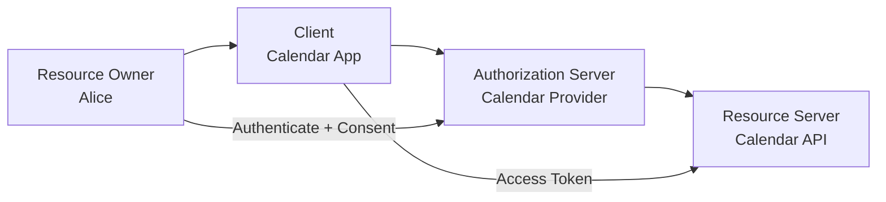

# 02 — Authentication vs Authorization

> **Core distinction:** Authentication answers **“Who are you?”** Authorization answers **“What are you allowed to do?”**

---

## Learning objectives

You should be able to:

- Separate identity, authentication, authorization, and accounting/auditing.
- Explain the relationship among users, sessions, credentials, tokens, roles, and permissions.
- Understand why OAuth is primarily an authorization framework while OpenID Connect adds an identity layer.
- Design a simple authorization model for an API.
- Diagnose common “authentication vs authorization” bugs.

---

## 1. The four questions of a secure system

A mature security architecture usually answers four separate questions:

```text
1. Identification      → Which principal is being referenced?
2. Authentication     → Can the principal prove control of an identity/credential?
3. Authorization      → What is that principal allowed to access/do?
4. Audit / Accounting → What happened, when, and under which principal?
```

These are related but not interchangeable.

---

## 2. Authentication

**Authentication** is the process of establishing that a claimed identity is associated with valid authentication evidence.

Common authentication factors include:

- Knowledge — password or PIN
- Possession — hardware key or device
- Inherence — biometric factor

A real system may use multiple factors.

### Example

```text
User enters:
  email = alice@example.com
  password = ********

Server verifies password against stored verifier
          ↓
Authentication succeeds
          ↓
Application establishes a session
```

Authentication does not automatically mean the user can do everything.

---

## 3. Authorization

**Authorization** determines whether an authenticated or otherwise identified principal can perform a specific action on a specific resource under specific conditions.

A useful model is:

```text
Subject + Action + Resource + Context = Authorization decision
```

Example:

```text
Subject: alice
Action:  DELETE
Resource: invoice/123
Context: tenant=acme

→ DENY
```

Even if Alice has authenticated successfully, she may not have permission to delete invoice `123`.

---

## 4. Authentication ≠ authorization

Consider a company dashboard:

```text
Alice logs in successfully.

Authentication:
  ✅ Alice proved control of her credential.

Authorization:
  ✅ Alice can view reports.
  ✅ Alice can create reports.
  ❌ Alice cannot delete billing records.
```

A common production bug is to stop at authentication:

```js
if (user) {
  // ❌ “user exists” is not an authorization decision
  return deleteBillingRecord(id);
}
```

Better:

```js
if (!user) {
  return res.status(401).json({ error: "authentication_required" });
}

if (!user.permissions.includes("billing:delete")) {
  return res.status(403).json({ error: "forbidden" });
}

return deleteBillingRecord(id);
```

The exact implementation varies, but the conceptual separation should remain.

---

## 5. Identity, principal, credential, session, token

These words are often mixed together.

| Term | Meaning |
|---|---|
| Identity | Representation of an entity in an identity system |
| Principal | Entity considered by a security decision |
| Credential | Evidence used for authentication |
| Session | Server/client state representing an authenticated interaction |
| Access token | Credential used to access a protected resource |
| ID token | OpenID Connect token carrying claims about an authenticated end-user |
| Permission | Specific allowed operation |
| Role | Named collection of permissions |
| Scope | OAuth authorization value expressing delegated access |

---

## 6. Where OAuth fits

OAuth 2.0 is an **authorization framework**. It enables a client to obtain limited access to a protected HTTP service, including access on behalf of a resource owner. [RFC 6749](https://www.rfc-editor.org/rfc/rfc6749.html)

A simplified model:

```text
             “May this client access resource X?”
                            │
                            ▼
                    OAuth authorization
```

OpenID Connect (OIDC) adds an identity layer on top of OAuth 2.0 so a client can verify the identity of the end-user based on authentication performed by an OpenID Provider. [OpenID Connect Core](https://openid.net/specs/openid-connect-core-1_0.html)

Therefore:

```text
OAuth 2.0 → delegated authorization
OIDC      → authentication/identity layer built on OAuth 2.0
```

---

## 7. Delegated authorization

Imagine Alice uses a calendar application that needs permission to read her Google Calendar.

Alice's password should be entered at the calendar provider, not handed to the third-party calendar application.



The client receives a limited authorization artifact rather than Alice's provider password.

This separation is one of OAuth's central security ideas.

---

## 8. Authentication systems vs authorization systems

### Authentication-centric system

```text
User
  ↓
Identity Provider
  ↓
Authenticated session / identity assertion
  ↓
Application
```

### OAuth authorization system

```text
Resource Owner
  ↓
Authorization Server
  ↓
Authorization Grant
  ↓
Access Token
  ↓
Resource Server
```

### OIDC system

```text
End-User
  ↓
OpenID Provider authenticates user
  ↓
Authorization response / token response
  ↓
Client validates ID Token + uses Access Token
```

---

## 9. Authorization models

### RBAC — Role-Based Access Control

```text
User → Role → Permission

Alice → Editor → article:write
Bob   → Viewer → article:read
```

Advantages:

- Easy to reason about.
- Works well for organizational roles.

Weakness:

- Roles can explode as business rules become fine-grained.

### ABAC — Attribute-Based Access Control

Authorization depends on attributes:

```text
user.department == resource.department
AND
user.clearance >= resource.classification
AND
request.ip in trusted_network
```

### ReBAC — Relationship-Based Access Control

Decision depends on relationships:

```text
Alice --member_of--> Team A
Team A --owns--> Project 42
Alice --can_edit--> Project 42
```

OAuth scopes are not a replacement for your entire internal authorization model. A scope such as `orders:read` can express what a client was delegated, while the resource server may still apply tenant, ownership, role, or relationship rules.

---

## 10. Scopes vs permissions vs roles

These three often overlap in naming but represent different layers.

### Scope

OAuth delegation vocabulary:

```text
scope = "orders:read orders:write"
```

### Permission

Application-level capability:

```text
permission = "invoice:delete"
```

### Role

A collection of permissions:

```text
role = billing-admin
permissions = {
  invoice:read,
  invoice:create,
  invoice:update,
  invoice:delete
}
```

A resource server can require both:

```text
OAuth scope: orders:read
      AND
Application rule: user owns order
```

---

## 11. Common failure patterns

### Failure 1 — “JWT means authenticated”

A JWT is a token format, not proof by itself that a request is authorized. Signature, issuer, audience, expiry, algorithm, key, token type, and application policy all matter.

JWT security best practice requires explicit algorithm validation and validation of claims such as issuer and audience where applicable. [RFC 8725](https://www.rfc-editor.org/rfc/rfc8725.html)

### Failure 2 — “User is logged in, so they can access everything”

This is an authorization bug.

### Failure 3 — “Scope is the same as role”

Scopes usually describe delegated access granted to a client. Roles describe application privileges. They can interact, but they are not conceptually identical.

### Failure 4 — “OAuth token = login session”

An access token is intended for protected resource access. In OIDC, the ID Token communicates authentication claims to the client. Mixing these responsibilities creates confused-deputy and token-validation problems.

---

## 12. Practical decision tree

```text
Request arrives
     │
     ├── Can the request be mapped to a principal?
     │       │
     │       └── No → authentication challenge / 401
     │
     ├── Is the credential/token valid?
     │       │
     │       └── No → 401 (where appropriate)
     │
     ├── Is the token intended for this resource?
     │       │
     │       └── No → reject
     │
     ├── Does the token grant required scope?
     │       │
     │       └── No → 403 or protocol-specific insufficient-scope response
     │
     ├── Does application policy permit the action?
     │       │
     │       └── No → 403
     │
     └── Allow operation
```

The exact HTTP response behavior should follow your API and protocol contract.

---

## 13. Practical example: multi-tenant API

Suppose:

```text
GET /tenants/acme/invoices/123
Authorization: Bearer <access-token>
```

A strong authorization check might verify:

```text
1. Token cryptographically valid
2. Token not expired
3. Issuer is trusted
4. Audience matches the API
5. Required scope includes invoice:read
6. Subject has access to tenant “acme”
7. Subject may read invoice 123
```

Passing one check does not prove all the others.

---

## 14. Security principle: least privilege

Give each client and principal only the access required for the intended task.

Bad:

```text
scope = "*"
```

Better:

```text
scope = "profile:read orders:read"
```

The narrower permission set reduces damage if a credential is leaked or a client is compromised.

---

## 15. Knowledge check

1. What is the difference between authentication and authorization?
2. Why can an authenticated user receive `403`?
3. Why is OAuth primarily considered authorization?
4. What problem does OIDC add on top of OAuth?
5. How are scopes different from roles?
6. Why should a resource server perform its own authorization checks?
7. Why is least privilege important for access tokens?

### Practical challenge

Design an API for a SaaS product with:

```text
Roles:
  owner
  admin
  member

Scopes:
  project:read
  project:write
  billing:read
```

Define which scopes each client can request, then define which resource-level checks the API must perform after scope validation.

---

## References

- [RFC 6749 — OAuth 2.0 Authorization Framework](https://www.rfc-editor.org/rfc/rfc6749.html)
- [RFC 8725 — JWT Best Current Practices](https://www.rfc-editor.org/rfc/rfc8725.html)
- [RFC 9700 — OAuth 2.0 Security Best Current Practice](https://www.rfc-editor.org/rfc/rfc9700.html)
- [OpenID Connect Core 1.0](https://openid.net/specs/openid-connect-core-1_0.html)

> **Takeaway:** Authenticate identities, authorize actions, and audit decisions separately. OAuth gives you a secure delegation framework; your resource server still owns the final authorization decision.
