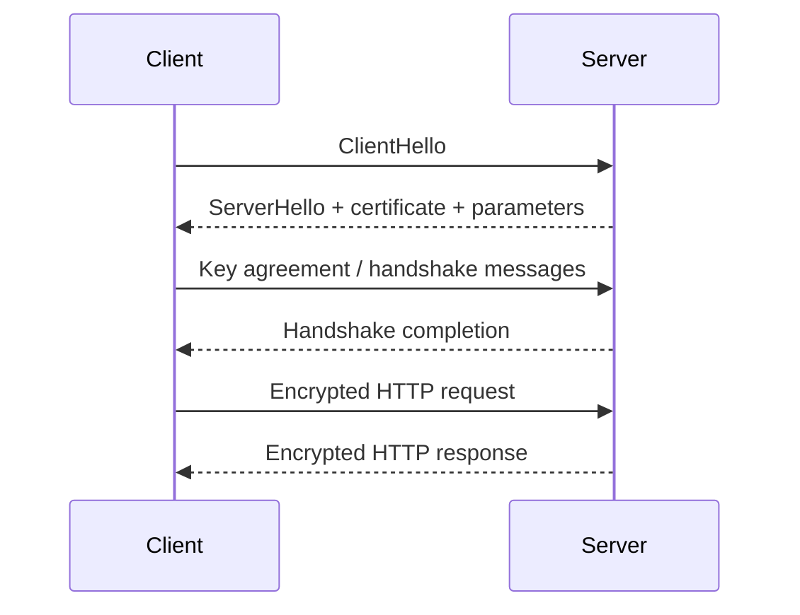

# 04 — Cryptography Basics for OAuth Engineers

> **Goal:** Learn enough applied cryptography to understand HTTPS, signatures, hashes, key management, JWTs, PKCE, and OAuth security without trying to become a cryptographer overnight.

---

## Learning objectives

You should be able to:

- Explain confidentiality, integrity, authenticity, and non-repudiation at a high level.
- Distinguish hashing, MACs, digital signatures, encryption, and key exchange.
- Understand symmetric vs asymmetric cryptography.
- Explain TLS at the conceptual level.
- Understand why PKCE uses a verifier/challenge pair.
- Avoid common cryptographic implementation mistakes.

---

## 1. Four security properties

### Confidentiality

Prevent unauthorized parties from learning protected data.

```text
Plaintext → encryption → ciphertext
```

### Integrity

Detect unauthorized modification.

```text
message + integrity mechanism → tamper detection
```

### Authenticity

Establish who or what produced a message, under the security model of the mechanism.

### Availability

Keep systems usable despite faults and attacks.

Cryptography helps with confidentiality, integrity, and authenticity, but it does not solve every security problem.

---

## 2. Hash functions

A cryptographic hash maps arbitrary input to a fixed-size digest.

```text
H(message) → digest
```

Properties expected from secure cryptographic hashes include resistance to practical preimage and collision attacks.

A common example is SHA-256.

### What hashes are good for

- Integrity fingerprints
- Content addressing
- Signature constructions
- Deriving/verifying values in protocols

### What hashing is NOT

```text
password → SHA-256(password) → store
```

This is not a modern password-storage design. Passwords should use dedicated password hashing functions such as Argon2id, scrypt, or an appropriately configured bcrypt implementation, with unique salts and parameters suited to the system.

---

## 3. Encryption

Encryption is intended to provide confidentiality.

### Symmetric encryption

The same secret key is used for encryption and decryption.

```text
plaintext
   │
   ├── encrypt(secret key)
   ▼
ciphertext
   │
   ├── decrypt(secret key)
   ▼
plaintext
```

Examples include AES-based constructions and ChaCha20-Poly1305.

### Authenticated encryption

Prefer authenticated-encryption constructions where appropriate because they provide confidentiality plus integrity/authenticity of the ciphertext under the key.

Conceptually:

```text
AEAD_Encrypt(key, nonce, plaintext, associated_data)
       ↓
   ciphertext + tag
```

---

## 4. Asymmetric cryptography

Asymmetric systems use a key pair:

```text
public key  ←→ private key
```

The private key must remain secret; the public key can usually be distributed.

Typical uses:

- Digital signatures
- Key establishment
- Client authentication
- TLS certificates
- JWT signing

---

## 5. Digital signatures

A simplified signature model:

```text
Message
  │
  └── Sign(private key) → Signature

Message + Signature + Public key
  │
  └── Verify → valid / invalid
```

The private key proves control of the signing capability, while the public key allows others to verify the signature.

### JWT connection

For signed JWTs, a JWS protects the header/payload against undetected modification under the selected cryptographic key and algorithm.

---

## 6. MACs

A Message Authentication Code uses a shared secret:

```text
MAC = MAC(secret, message)
```

Anyone who can verify the MAC also generally possesses the secret, so MAC-based trust differs from public-key signature trust.

In simplified terms:

```text
HMAC → symmetric authentication/integrity mechanism
JWS with RSA/ECDSA/EdDSA → asymmetric signature model
```

---

## 7. Hash vs encryption vs signature

| Mechanism            | Secret key?             |   Reversible? | Main purpose               |
| -------------------- | ----------------------- | ------------: | -------------------------- |
| Hash                 | No                      |            No | Digest/integrity primitive |
| Symmetric encryption | Yes                     | Yes, with key | Confidentiality            |
| MAC                  | Yes/shared              |            No | Integrity/authentication   |
| Digital signature    | Private/public key pair |            No | Integrity/authentication   |

Do not say “encrypt the password with SHA-256.” Hashing and encryption solve different problems.

---

## 8. Randomness and entropy

Security protocols need unpredictable values:

- session identifiers
- state values
- nonces
- cryptographic keys
- PKCE code verifiers

Use a cryptographically secure random number generator (CSPRNG) provided by your platform.

Bad:

```js
Math.random();
```

For security-sensitive values in Node.js:

```js
import { randomBytes } from "node:crypto";

const state = randomBytes(32).toString("base64url");
```

---

## 9. Nonces and uniqueness

A nonce is commonly a number/value used once in a protocol context.

The exact requirements vary by algorithm. Some constructions require unpredictability; others require uniqueness; some require both.

Never assume:

```text
“nonce” = “any random-looking string”
```

Read the specific protocol/algorithm requirements.

---

## 10. TLS at a high level

HTTPS normally means HTTP carried over TLS.

Conceptually:



Modern TLS negotiates cryptographic parameters and establishes session keys. The exact handshake differs by version and configuration; this diagram is intentionally conceptual.

For OAuth engineers, the important point is:

```text
TLS protects the channel.
OAuth protects delegation semantics.
JWT/JWS protects token integrity according to its profile.
Application authorization protects the actual resource.
```

You normally need all of these layers, not just one.

---

## 11. PKCE: proof of possession of a verifier

PKCE adds a secret `code_verifier` generated by the client and a derived `code_challenge` sent in the authorization request.

Conceptually:

```text
Client generates:
  code_verifier = random secret

code_challenge = BASE64URL(SHA-256(code_verifier))

Authorization Request:
  code_challenge=...
  code_challenge_method=S256

Later Token Request:
  code_verifier=...
```

The authorization server checks that the verifier produces the previously supplied challenge.

RFC 7636 was designed to mitigate authorization-code interception for public clients, and OAuth security best practice recommends PKCE for public clients. [RFC 7636](https://www.rfc-editor.org/rfc/rfc7636.html), [RFC 9700](https://www.rfc-editor.org/rfc/rfc9700.html)

### Why this works

An attacker who steals only the authorization code does not know the client's verifier.

```text
Attacker:
  stolen code = ✅
  code_verifier = ❌

Token exchange:
  rejected
```

---

## 12. Key management is more important than clever crypto

Production failures often come from:

- leaked private keys
- hard-coded secrets
- no rotation process
- weak key storage
- incorrect certificate validation
- wrong algorithm/key combination
- secrets committed to Git

A mature design includes:

```text
Generate
   ↓
Store securely
   ↓
Restrict access
   ↓
Use
   ↓
Rotate
   ↓
Revoke / retire
   ↓
Audit
```

Do not put long-term production private keys in `.env` files committed to source control.

---

## 13. Cryptographic agility

Protocols evolve. Algorithms can become weak or inappropriate for new threat models.

Do not hard-code “one crypto algorithm forever” without a migration strategy.

This is one reason standardized metadata and key identifiers matter in OAuth/OIDC deployments. RFC 9700 recommends authorization server metadata and modern key-management practices that can reduce configuration mistakes and support cryptographic agility. [RFC 9700](https://www.rfc-editor.org/rfc/rfc9700.html)

---

## 14. Side-channel awareness

Even mathematically secure algorithms can be used unsafely.

Examples:

- timing leaks
- unsafe error differences
- key-dependent memory behavior
- predictable randomness
- nonce reuse
- padding-oracle conditions

The right response is usually to use a well-reviewed standard library and protocol implementation rather than implementing cryptographic primitives yourself.

---

## 15. Practical Node.js examples

### Secure random value

```js
import { randomBytes } from "node:crypto";

const sessionId = randomBytes(32).toString("base64url");
console.log(sessionId);
```

### SHA-256 digest

```js
import { createHash } from "node:crypto";

const digest = createHash("sha256").update("example").digest("hex");

console.log(digest);
```

A digest is not an encryption operation.

### HMAC example

```js
import { createHmac } from "node:crypto";

const mac = createHmac("sha256", process.env.HMAC_SECRET)
  .update("important-message")
  .digest("hex");
```

Use protocol-specific constructions and libraries rather than designing your own authentication format.

---

## 16. Security review checklist

Before approving crypto-related code:

- [ ] Is the primitive standard and appropriate?
- [ ] Is randomness generated by a CSPRNG?
- [ ] Are keys protected from source control and logs?
- [ ] Are keys rotated?
- [ ] Are algorithms explicitly allowed?
- [ ] Are nonces used exactly as the algorithm requires?
- [ ] Is authenticated encryption used where appropriate?
- [ ] Are signature verification rules explicit?
- [ ] Is TLS certificate validation enabled?
- [ ] Are production cryptographic primitives implemented by trusted libraries?

---

## Knowledge check

1. What is the difference between a hash and encryption?
2. Why can a digital signature be verified with a public key?
3. What is the purpose of a MAC?
4. Why is `Math.random()` inappropriate for security tokens?
5. How does PKCE stop a code-interception attacker who lacks the verifier?
6. Why is key rotation an engineering problem, not just a cryptography problem?
7. What does TLS protect that a JWT signature does not?

### Practical challenge

Implement a small “crypto playground” that safely demonstrates:

```text
SHA-256
HMAC-SHA-256
randomBytes
RSA/EC/EdDSA signature verification using a library
PKCE S256 challenge generation
```

Write a short test for each function and explicitly label **what security property it provides** and **what it does not provide**.

---

## References

- [RFC 7519 — JSON Web Token](https://www.rfc-editor.org/rfc/rfc7519.html)
- [RFC 8725 — JWT Best Current Practices](https://www.rfc-editor.org/rfc/rfc8725.html)
- [RFC 7636 — Proof Key for Code Exchange by OAuth Public Clients](https://www.rfc-editor.org/rfc/rfc7636.html)
- [RFC 9700 — OAuth 2.0 Security Best Current Practice](https://www.rfc-editor.org/rfc/rfc9700.html)
- [RFC 9110 — HTTP Semantics](https://www.rfc-editor.org/rfc/rfc9110.html)

> **Takeaway:** Cryptography is a toolkit. Secure OAuth engineering comes from choosing the right primitive, using it exactly as specified, protecting keys, and validating protocol context.
