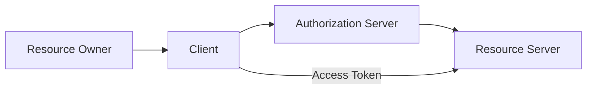
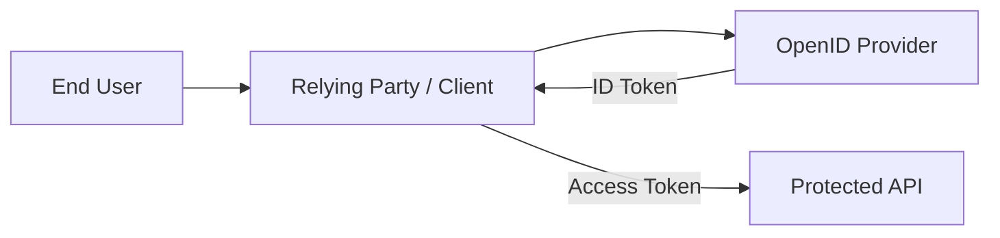
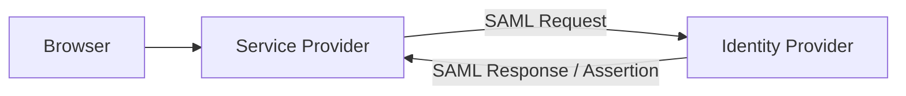

# 05 — OAuth 2.0 vs SAML vs OpenID Connect (OIDC)

> **The key idea:** These technologies overlap around identity and access, but they solve different protocol problems and use different representations and deployment patterns.

---

## Learning objectives

By the end of this chapter, you should be able to:

- Explain what OAuth 2.0, OIDC, and SAML are designed to accomplish.
- Distinguish authorization from authentication/identity federation.
- Compare their common flows and artifacts.
- Choose an appropriate technology for a new system.
- Avoid the common mistake of calling OAuth “a login protocol.”

---

## 1. Executive comparison

| Technology | Primary purpose                            | Typical representation          | Common modern use                   |
| ---------- | ------------------------------------------ | ------------------------------- | ----------------------------------- |
| OAuth 2.0  | Delegated authorization                    | HTTP + token formats            | API authorization, delegated access |
| OIDC       | Authentication/identity layer on OAuth 2.0 | JWT ID Token + OAuth mechanisms | Web/mobile/social login, SSO        |
| SAML 2.0   | Federated identity/security assertions     | XML assertions/messages         | Enterprise web SSO                  |

OAuth 2.0 is an authorization framework. OIDC is an identity layer built on OAuth 2.0. SAML defines an XML-based framework for exchanging security information and assertions across trust boundaries. [RFC 6749](https://www.rfc-editor.org/rfc/rfc6749.html), [OpenID Connect Core](https://openid.net/specs/openid-connect-core-1_0.html), [OASIS SAML Technical Overview](https://docs.oasis-open.org/security/saml/Post2.0/sstc-saml-tech-overview-2.0-cd-02.html)

---

## 2. OAuth 2.0

### Problem it solves

A client application wants controlled access to a protected HTTP resource without obtaining the resource owner's primary credentials.

Example:

```text
Photo App
   │
   │ “May I read your photos?”
   ▼
Authorization Server
   │
   │ access token
   ▼
Photo API
```

RFC 6749 defines the OAuth 2.0 roles as resource owner, client, authorization server, and resource server. [RFC 6749](https://www.rfc-editor.org/rfc/rfc6749.html)

### OAuth does not inherently answer

```text
“Who is this human?”
```

It answers an authorization question such as:

```text
“Does this client have permission to call this protected resource?”
```

---

## 3. OpenID Connect

OpenID Connect adds an identity layer on top of OAuth 2.0.

Its purpose is to let a relying party verify the identity of an end-user based on authentication performed by an OpenID Provider, and obtain claims about that end-user. [OpenID Connect Core](https://openid.net/specs/openid-connect-core-1_0.html)

The central artifact is the **ID Token**.

Conceptually:

```text
OIDC Provider
    │
    ├── ID Token → “This authentication resulted in identity X”
    │
    └── Access Token → “Client may access resource Y”
```

This is why OIDC is the normal protocol layer to discuss when you say “Sign in with …” in an OAuth-based ecosystem.

---

## 4. SAML 2.0

SAML is an XML-based framework for exchanging security information using assertions between parties. OASIS describes it as a framework for expressing and exchanging security information and portable SAML assertions across security-domain boundaries. [OASIS SAML Technical Overview](https://docs.oasis-open.org/security/saml/Post2.0/sstc-saml-tech-overview-2.0-cd-02.html)

A common enterprise pattern is:

```text
Employee Browser
      │
      ▼
Service Provider (SP)
      │
      │ SAML authentication request
      ▼
Identity Provider (IdP)
      │
      │ SAML Response + Assertion
      ▼
Service Provider
      │
      ▼
Authenticated session
```

SAML remains important in enterprise environments where existing identity infrastructure, federation agreements, and mature SP/IdP integrations are built around SAML.

---

## 5. Side-by-side architecture

### OAuth 2.0 — delegated API access



### OIDC — identity + OAuth



### SAML — federated enterprise identity



---

## 6. Core artifacts

| Technology | Primary artifact(s)                                               |
| ---------- | ----------------------------------------------------------------- |
| OAuth 2.0  | Authorization grant, access token, refresh token where applicable |
| OIDC       | ID Token, access token, claims, UserInfo response                 |
| SAML       | Assertions, authentication/attribute statements, SAML responses   |

### Representation differences

```text
OAuth/OIDC → URL parameters + HTTP + JSON/JWT in many deployments
SAML       → XML-based messages/assertions
```

These are broad architectural descriptions; specific profiles and extensions define exact wire formats.

---

## 7. “Login with X” — which protocol is actually involved?

When a product says:

```text
“Continue with Google”
“Sign in with Microsoft”
“Sign in with …”
```

the modern web/mobile implementation is commonly based on OpenID Connect, even though the underlying protocol interactions use OAuth 2.0 mechanisms.

The application wants an identity result, so it needs OIDC's identity semantics rather than OAuth alone.

---

## 8. OAuth vs OIDC in one example

Suppose a client requests:

```text
scope=openid profile
```

The `openid` scope signals an OpenID Connect request in the OIDC model.

The client may receive:

```json
{
  "id_token": "eyJ...",
  "access_token": "..."
}
```

Conceptually:

```text
ID Token
  → identity/authentication result for the client

Access Token
  → authorization credential for a protected resource
```

Do not replace one with the other.

---

## 9. Why OAuth is not “login”

Consider:

```text
Application A wants to read Application B's API.
```

No user identity needs to be exposed to Application A for this to be useful. OAuth can support client-based authorization flows such as client credentials.

Therefore:

```text
OAuth can authorize software without authenticating a human user.
```

This alone demonstrates why OAuth and “login” are not synonymous.

---

## 10. When to use OAuth 2.0

Choose OAuth when the principal problem is:

- delegated API access
- service-to-service authorization
- scoped access to protected resources
- clients accessing APIs on behalf of a resource owner

Typical examples:

```text
SPA → API
Mobile App → API
Backend → SaaS API
Microservice → Microservice API
```

---

## 11. When to use OIDC

Choose OIDC when the system needs:

- user authentication
- federated login
- interoperable identity claims
- an ID Token
- a standard identity layer alongside OAuth authorization

Typical examples:

```text
Web app login
Mobile login
Enterprise/social identity integration
Single sign-on using OIDC providers
```

---

## 12. When SAML can be the right choice

SAML is often appropriate when integrating with existing enterprise identity systems that already use SAML federation.

Common reasons include:

- Established enterprise IdP/SP relationships
- Existing SAML configuration and governance
- Legacy enterprise applications
- Organizational federation requirements

For a greenfield consumer application, OIDC is often a more natural fit when JSON/HTTP/web/mobile ecosystems are the target—but the actual decision depends on the identity platform and integration requirements.

---

## 13. Protocol comparison matrix

| Dimension              | OAuth 2.0             | OIDC                          | SAML 2.0                      |
| ---------------------- | --------------------- | ----------------------------- | ----------------------------- |
| Primary problem        | Authorization         | Authentication + identity     | Federated identity/assertions |
| Human login            | Not the core purpose  | Yes                           | Yes                           |
| API delegation         | Excellent             | Also uses OAuth access tokens | Not its primary model         |
| Typical format         | HTTP + token response | HTTP + JWT claims             | XML                           |
| Main identity artifact | None by OAuth itself  | ID Token                      | SAML Assertion                |
| Browser redirects      | Common                | Common                        | Very common                   |
| Mobile/native use      | Strong with PKCE      | Strong with PKCE              | Less common                   |
| Enterprise legacy SSO  | Sometimes             | Often                         | Very common                   |
| API authorization      | Core use case         | Through OAuth access tokens   | Not primary                   |

---

## 14. Security differences and shared responsibilities

Regardless of protocol, you still need:

```text
TLS
Secure redirects
Input validation
Key/secret management
Replay protection
Correct audience / recipient validation
Logging and monitoring
Least privilege
Threat modeling
```

For OAuth 2.0, current security best practice is documented by RFC 9700, which deprecates weaker modes and recommends stronger protections such as PKCE and exact redirect URI matching. [RFC 9700](https://www.rfc-editor.org/rfc/rfc9700.html)

OIDC adds identity-specific validation requirements, especially around ID Tokens, issuer, audience, nonce, and authentication context.

SAML deployments similarly require careful validation of signatures, issuers, recipients, assertions, timestamps, and trust configuration.

---

## 15. Decision tree

```text
Do you need delegated API access?
          │
         Yes
          │
       OAuth 2.0
          │
          ├── Need user authentication / identity? ── Yes → Add OIDC
          │
          └── Software-to-software? ──────────────── Yes → OAuth flow

Do you need enterprise SSO with an existing SAML federation?
          │
         Yes
          │
       SAML 2.0
```

In real architectures, protocol bridges are common:

```text
Legacy SAML IdP
      ↓
Identity Platform
      ↓
OIDC / OAuth
      ↓
Modern Applications + APIs
```

---

## 16. Migration pattern: SAML → OIDC

Organizations modernizing application platforms often centralize identity in an identity platform capable of integrating legacy federation while exposing modern OIDC/OAuth interfaces.

A conceptual architecture:

```text
                ┌───────────────┐
                │ Legacy SAML   │
                │ IdP / SP      │
                └──────┬────────┘
                       │
                       ▼
                ┌───────────────┐
                │ Identity      │
                │ Platform      │
                └──────┬────────┘
                       │
          ┌────────────┼────────────┐
          ▼            ▼            ▼
        OIDC         OAuth        SAML
         Apps         APIs       Legacy
```

This lets an organization modernize application interfaces without necessarily replacing every identity integration at once.

---

## 17. Practical comparison exercise

For each scenario choose **OAuth 2.0**, **OIDC**, **SAML**, or a combination.

### Scenario A

A backend service needs to call another internal API without a human user.

**Likely:** OAuth 2.0 with an appropriate client/service flow.

### Scenario B

A mobile app needs “Sign in with Company Identity Provider.”

**Likely:** OIDC over OAuth 2.0, with platform-appropriate browser-based authorization and PKCE.

### Scenario C

A large enterprise already operates a SAML IdP and requires a vendor SaaS application to participate in corporate SSO.

**Likely:** SAML 2.0, unless the organization/provider offers a preferred OIDC integration.

### Scenario D

A third-party application needs limited permission to read a user's calendar.

**Likely:** OAuth 2.0 delegation.

---

## 18. Interview questions

### Q1: Is OAuth an authentication protocol?

**Answer:** OAuth 2.0 is an authorization framework. It can participate in user-centric flows, but identity authentication semantics are provided by protocols such as OpenID Connect.

### Q2: What is OIDC?

**Answer:** An identity layer built on OAuth 2.0 that enables clients to verify an end-user's identity and obtain standardized identity claims.

### Q3: Why does SAML still exist?

**Answer:** It is deeply established in enterprise federation and SSO environments, with mature tooling, governance, and deployment patterns.

### Q4: Why should you not use an OAuth access token as proof of login identity?

**Answer:** An access token is intended to authorize access to a protected resource. Its audience, claims, and validation semantics are different from an OIDC ID Token's identity assertions.

---

## Knowledge check

1. What problem does OAuth solve?
2. What problem does OIDC solve?
3. What problem does SAML solve?
4. Why is an ID Token different from an access token?
5. Why is SAML commonly associated with enterprise SSO?
6. Why is OIDC commonly used for modern application login?
7. Can OAuth work without authenticating a human user?
8. When might an organization support SAML and OIDC simultaneously?

### Practical challenge

Create a one-page architecture decision record for a fictional company:

```text
Company: Acme Cloud
Clients: Web + Mobile
APIs: 15 services
Legacy Enterprise SSO: SAML
New applications: JSON/HTTP
Requirement: centralized login + API authorization
```

Your decision should explain:

```text
Where OAuth is used
Where OIDC is used
Where SAML is retained
How identity flows into API authorization
How tokens are validated
Why the design follows least privilege
```

---

## References

### OAuth

- [RFC 6749 — The OAuth 2.0 Authorization Framework](https://www.rfc-editor.org/rfc/rfc6749.html)
- [RFC 9700 — OAuth 2.0 Security Best Current Practice](https://www.rfc-editor.org/rfc/rfc9700.html)
- [RFC 6750 — Bearer Token Usage](https://www.rfc-editor.org/rfc/rfc6750.html)

### OIDC

- [OpenID Connect Core 1.0](https://openid.net/specs/openid-connect-core-1_0.html)
- [OpenID Connect Specifications](https://openid.net/developers/specs/)

### SAML

- [OASIS SAML Technical Overview](https://docs.oasis-open.org/security/saml/Post2.0/sstc-saml-tech-overview-2.0-cd-02.html)

> **Takeaway:** Think in layers: **OAuth for authorization, OIDC for identity on top of OAuth, and SAML for assertion-based federation—especially in established enterprise environments.**
