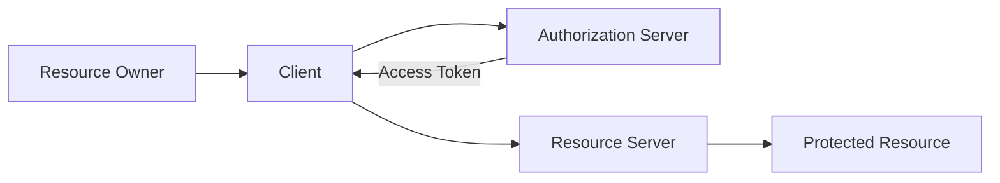

# 01 — What Is OAuth 2.0?

> **Handbook standard:** This chapter is written as a practical engineering reference. It separates protocol semantics from implementation choices and highlights security implications.

## Learning objectives

- Explain the protocol concept in precise terminology.
- Trace the relevant HTTP messages and trust boundaries.
- Recognize implementation and security failure modes.
- Apply the concept in production-oriented designs.

## Practical mindset

OAuth is an authorization framework, not a login protocol by itself. Treat tokens as security credentials, minimize privilege, validate inputs at trust boundaries, and prefer current security best practices over legacy interoperability shortcuts.

## 1. Core idea

OAuth 2.0 lets a client obtain delegated access to a protected resource without receiving the resource owner's password. The authorization server mediates permission, then issues an access token representing the granted authorization.

## 2. Mental model

The important distinction is **delegation**. The client is not automatically trusted with the user's credentials; it receives a credential with limited authority.

## 3. What OAuth does not define

OAuth does not by itself define user authentication, account recovery, password policy, or a universal token format. OpenID Connect layers an identity protocol on top of OAuth for authentication and user information.

## 4. Typical authorization-code sequence

1. Client prepares an authorization request.
2. Resource owner authenticates and authorizes at the authorization server.
3. Authorization server returns a short-lived authorization code.
4. Client exchanges the code at the token endpoint.
5. Authorization server returns an access token and, when applicable, a refresh token.
6. Client presents the access token to the resource server.

## 5. Security boundary

The browser is often only a transport/user-agent. Do not assume that anything crossing the browser is secret. Secrets belong in confidential server-side components; public clients should rely on mechanisms such as PKCE instead of embedding a client secret.

## Practice

Sketch OAuth for a GitHub-style third-party integration. Label every request, credential, redirect, and trust boundary. Then identify which component could impersonate which other component if an authorization code or access token leaked.

## Standards and references

- [RFC 6749 — OAuth 2.0 Authorization Framework](https://www.rfc-editor.org/rfc/rfc6749.html)
- [RFC 9700 — OAuth 2.0 Security Best Current Practice](https://www.rfc-editor.org/rfc/rfc9700.html)

---

**Next:** Continue to the next chapter in this section.
