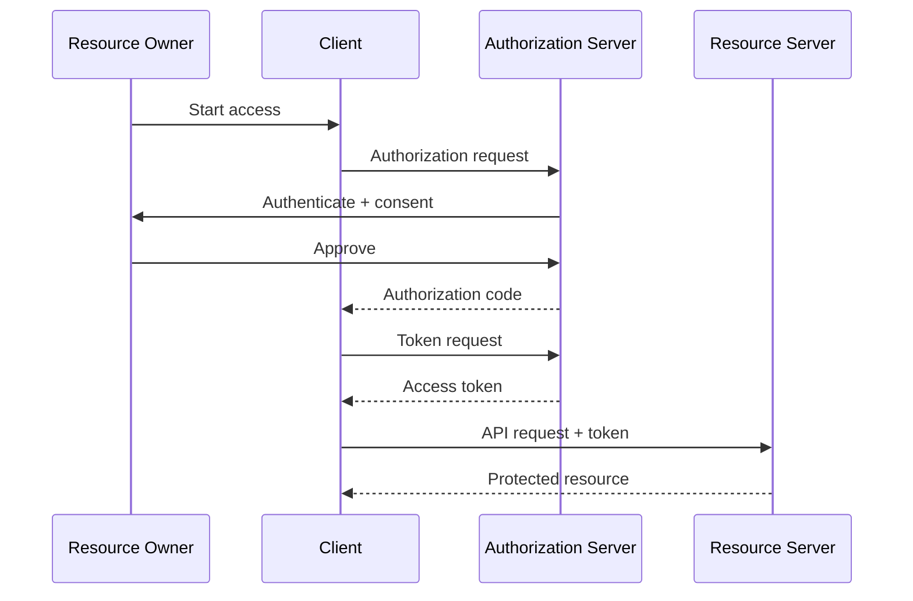

# 02 — OAuth 2.0 Roles and Trust Boundaries

> **Handbook standard:** This chapter is written as a practical engineering reference. It separates protocol semantics from implementation choices and highlights security implications.

## Learning objectives

- Explain the protocol concept in precise terminology.
- Trace the relevant HTTP messages and trust boundaries.
- Recognize implementation and security failure modes.
- Apply the concept in production-oriented designs.

## Practical mindset

OAuth is an authorization framework, not a login protocol by itself. Treat tokens as security credentials, minimize privilege, validate inputs at trust boundaries, and prefer current security best practices over legacy interoperability shortcuts.

## 1. The four roles

| Role                 | Responsibility                             | Typical deployment             |
| -------------------- | ------------------------------------------ | ------------------------------ |
| Resource owner       | Grants access to protected resources       | End user or service principal  |
| Client               | Requests access                            | Web app, mobile app, backend   |
| Authorization server | Authenticates/authorizes and issues tokens | Identity/authorization service |
| Resource server      | Accepts tokens and serves protected data   | API                            |

## 2. Role relationships

## 3. Do not collapse roles conceptually

A resource server can be a different service from the authorization server. A client can also be a backend service instead of a browser application. These distinctions matter for token audience, client authentication, and deployment security.

## 4. Trust-boundary exercise

For a SPA + API architecture, mark these as separate boundaries: browser ↔ authorization server, browser ↔ API, API ↔ authorization server, and administrator ↔ deployment platform. Decide what can be trusted at each boundary and what must be validated.

## Standards and references

- [RFC 6749](https://www.rfc-editor.org/rfc/rfc6749.html)
- [RFC 9700](https://www.rfc-editor.org/rfc/rfc9700.html)

---

**Next:** Continue to the next chapter in this section.
