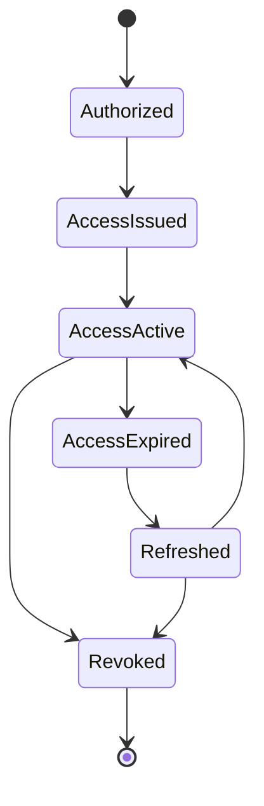

# 05 — Access Tokens and Refresh Tokens

> **Handbook standard:** This chapter is written as a practical engineering reference. It separates protocol semantics from implementation choices and highlights security implications.

## Learning objectives

- Explain the protocol concept in precise terminology.
- Trace the relevant HTTP messages and trust boundaries.
- Recognize implementation and security failure modes.
- Apply the concept in production-oriented designs.

## Practical mindset

OAuth is an authorization framework, not a login protocol by itself. Treat tokens as security credentials, minimize privilege, validate inputs at trust boundaries, and prefer current security best practices over legacy interoperability shortcuts.

## Access token

An access token is a credential used by a client to access a protected resource. It should be scoped and audience-restricted as appropriate.

Typical bearer API call:

```http
GET /api/profile HTTP/1.1
Host: api.example.com
Authorization: Bearer eyJ...
```

## Refresh token

A refresh token is presented to the authorization server to obtain a fresh access token without requiring the resource owner to repeat the entire authorization interaction. It is generally more sensitive because it can create a new access token.

## Token lifecycle



## Practical policy

- Keep access tokens short-lived enough to limit replay impact.
- Protect refresh tokens like high-value credentials.
- Rotate or otherwise bind refresh-token usage according to current security guidance.
- Revoke tokens after meaningful security events when appropriate.
- Never log raw token values.

## Standards and references

- [RFC 6749](https://www.rfc-editor.org/rfc/rfc6749.html)
- [RFC 9700](https://www.rfc-editor.org/rfc/rfc9700.html)
- [RFC 6750 — Bearer Token Usage](https://www.rfc-editor.org/rfc/rfc6750.html)

---

**Next:** Continue to the next chapter in this section.
