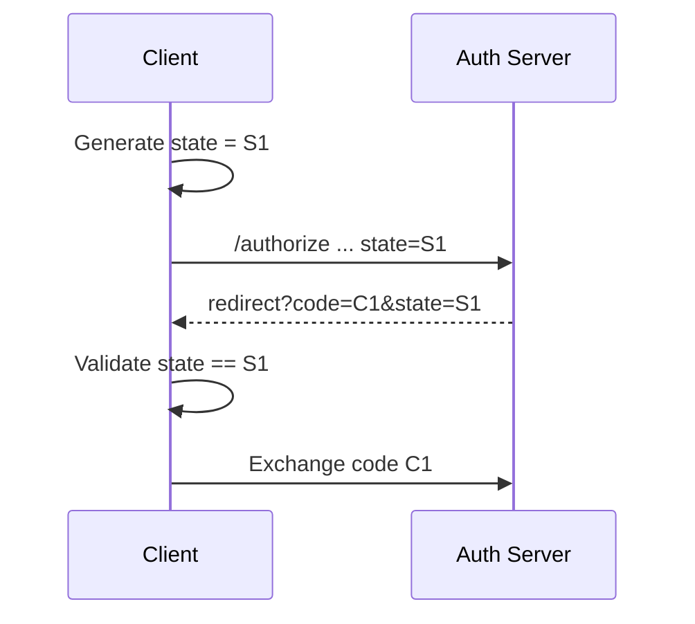

# 07 — Redirect URIs and the State Parameter

> **Handbook standard:** This chapter is written as a practical engineering reference. It separates protocol semantics from implementation choices and highlights security implications.

## Learning objectives

- Explain the protocol concept in precise terminology.
- Trace the relevant HTTP messages and trust boundaries.
- Recognize implementation and security failure modes.
- Apply the concept in production-oriented designs.

## Practical mindset

OAuth is an authorization framework, not a login protocol by itself. Treat tokens as security credentials, minimize privilege, validate inputs at trust boundaries, and prefer current security best practices over legacy interoperability shortcuts.

## 1. Redirect URI

The authorization server sends the user agent back to a client-controlled callback after authorization. The callback is a high-value trust boundary because authorization codes can arrive there.

Prefer exact pre-registered redirect URIs. Do not treat a user-provided redirect URI as trusted input merely because it appears in an OAuth request.

## 2. State

`state` binds the authorization response to the client transaction that initiated the flow. A secure client generates a fresh unpredictable value and verifies it on return.

## 3. What state protects against

State is commonly used to prevent login-CSRF / authorization-response mix-up attacks. It does not replace PKCE, secure redirect registration, HTTPS, or token validation.

## Checklist

- Exact redirect URI registration.
- HTTPS in production.
- High-entropy state.
- One-time state consumption.
- Expiration and replay protection.
- PKCE for public/browser/native clients.

## Standards and references

- [RFC 6749](https://www.rfc-editor.org/rfc/rfc6749.html)
- [RFC 7636](https://www.rfc-editor.org/rfc/rfc7636.html)
- [RFC 9700](https://www.rfc-editor.org/rfc/rfc9700.html)

---

**Next:** Continue to the next chapter in this section.
