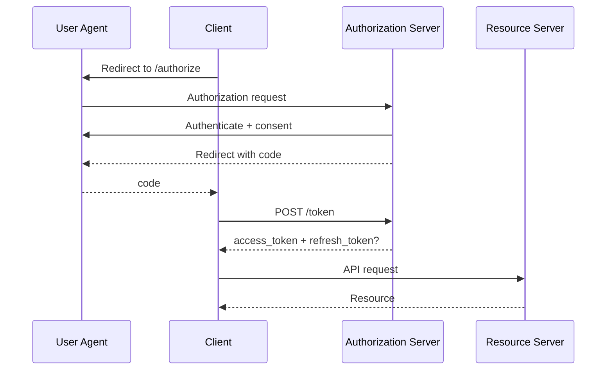

# 01 — Authorization Code Grant

> **Handbook standard:** This chapter is written as a practical engineering reference. It separates protocol semantics from implementation choices and highlights security implications.

## Learning objectives

- Explain the protocol concept in precise terminology.
- Trace the relevant HTTP messages and trust boundaries.
- Recognize implementation and security failure modes.
- Apply the concept in production-oriented designs.

## Practical mindset

OAuth is an authorization framework, not a login protocol by itself. Treat tokens as security credentials, minimize privilege, validate inputs at trust boundaries, and prefer current security best practices over legacy interoperability shortcuts.

## Overview

The authorization code flow separates browser-facing authorization from token issuance. The browser carries a short-lived code; the client exchanges it directly with the token endpoint.



## Security properties

Use an exact redirect URI, `state`, and PKCE where appropriate. The authorization code should be short-lived and single-use. The token exchange should verify the client binding expected by the registered profile.

## Minimal request

```http
GET /authorize?response_type=code&client_id=app123&redirect_uri=https%3A%2F%2Fapp.example%2Fcb&scope=openid%20profile&state=abc&code_challenge=...&code_challenge_method=S256 HTTP/1.1
Host: auth.example.com
```

## Implementation exercise

Build a mock provider and client. Log only `client_id`, scope, state hash, and transaction IDs—never raw codes or tokens.

## Standards and references

- [RFC 6749](https://www.rfc-editor.org/rfc/rfc6749.html)
- [RFC 7636](https://www.rfc-editor.org/rfc/rfc7636.html)
- [RFC 9700](https://www.rfc-editor.org/rfc/rfc9700.html)

---

**Next:** Continue to the next chapter in this section.
