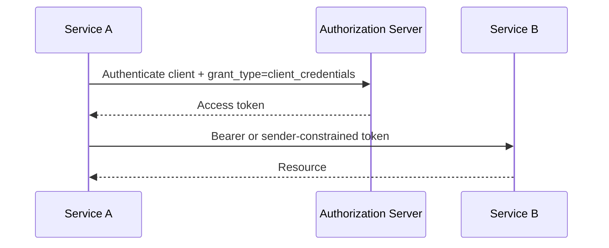

# 04 — Client Credentials Grant

> **Handbook standard:** This chapter is written as a practical engineering reference. It separates protocol semantics from implementation choices and highlights security implications.

## Learning objectives

- Explain the protocol concept in precise terminology.
- Trace the relevant HTTP messages and trust boundaries.
- Recognize implementation and security failure modes.
- Apply the concept in production-oriented designs.

## Practical mindset

OAuth is an authorization framework, not a login protocol by itself. Treat tokens as security credentials, minimize privilege, validate inputs at trust boundaries, and prefer current security best practices over legacy interoperability shortcuts.

## Use case

Client Credentials is intended for machine-to-machine access where the client acts on its own behalf rather than on behalf of an end user.

```http
POST /oauth/token HTTP/1.1
Host: auth.example.com
Content-Type: application/x-www-form-urlencoded
Authorization: Basic <client-auth>

grant_type=client_credentials&scope=inventory:read
```

## Flow



## Security design

Use strong client authentication. Avoid embedding static long-lived secrets in source control or container images. Limit scopes and audience. For higher assurance deployments, consider sender-constrained mechanisms such as mTLS or DPoP where supported.

## Failure modes

Using client credentials when a user is actually the subject can erase accountability and over-grant authority. Model subject identity and business authorization explicitly.

## Standards and references

- [RFC 6749](https://www.rfc-editor.org/rfc/rfc6749.html)
- [RFC 8705](https://www.rfc-editor.org/rfc/rfc8705.html)
- [RFC 9449](https://www.rfc-editor.org/rfc/rfc9449.html)
- [RFC 9700](https://www.rfc-editor.org/rfc/rfc9700.html)

---

**Next:** Continue to the next chapter in this section.
