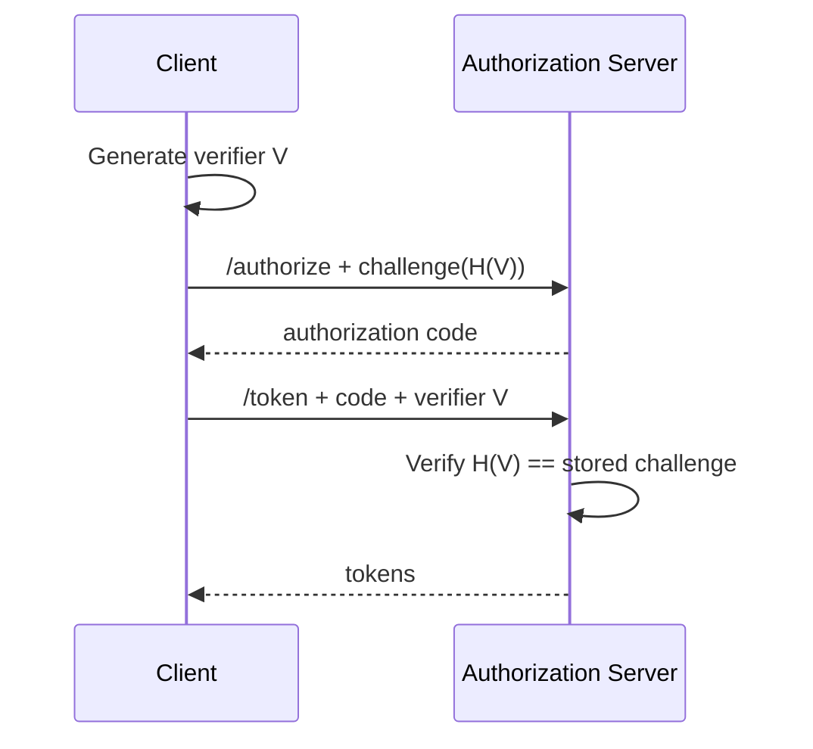

# 07 — PKCE and Authorization Code with PKCE

> **Handbook standard:** This chapter is written as a practical engineering reference. It separates protocol semantics from implementation choices and highlights security implications.

## Learning objectives

- Explain the protocol concept in precise terminology.
- Trace the relevant HTTP messages and trust boundaries.
- Recognize implementation and security failure modes.
- Apply the concept in production-oriented designs.

## Practical mindset

OAuth is an authorization framework, not a login protocol by itself. Treat tokens as security credentials, minimize privilege, validate inputs at trust boundaries, and prefer current security best practices over legacy interoperability shortcuts.

## 1. The problem

An authorization code can be stolen from a compromised redirect or user-agent environment. PKCE binds the later token exchange to proof held by the client that initiated the transaction.

## 2. The mechanism

The client generates a high-entropy `code_verifier`, derives a `code_challenge`, and sends the challenge in the authorization request. During the token exchange it sends the verifier.

```text
code_verifier = random secret
code_challenge = BASE64URL(SHA256(code_verifier))
```



## Recommended method

Use `S256`. Do not downgrade to weaker methods merely because an implementation makes that easier.

## Practical note

PKCE protects the authorization-code exchange; it does not replace `state`, secure redirect URI registration, HTTPS, or access-token protection.

## Standards and references

- [RFC 7636 — PKCE](https://www.rfc-editor.org/rfc/rfc7636.html)
- [RFC 9700](https://www.rfc-editor.org/rfc/rfc9700.html)

---

**Next:** Continue to the next chapter in this section.
