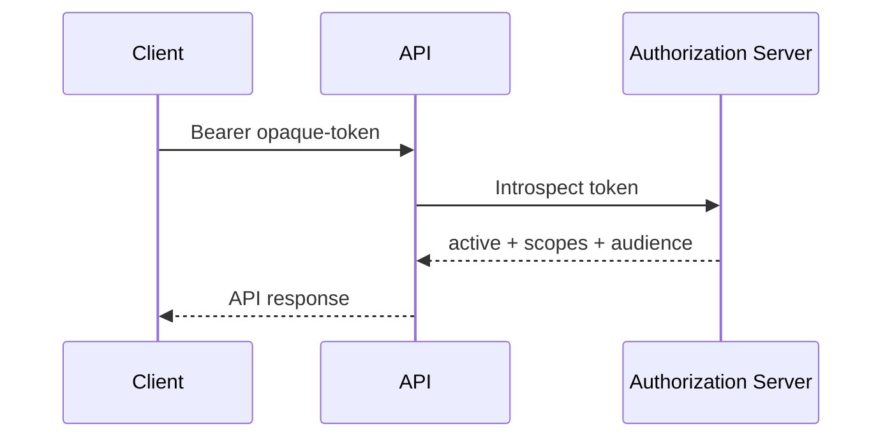

# 03 — Opaque Tokens vs JWT

> **Handbook standard:** This chapter is written as a practical engineering reference. It separates protocol semantics from implementation choices and highlights security implications.

## Learning objectives
- Explain the protocol concept in precise terminology.
- Trace the relevant HTTP messages and trust boundaries.
- Recognize implementation and security failure modes.
- Apply the concept in production-oriented designs.

## Practical mindset
OAuth is an authorization framework, not a login protocol by itself. Treat tokens as security credentials, minimize privilege, validate inputs at trust boundaries, and prefer current security best practices over legacy interoperability shortcuts.

## Comparison
| Property | Opaque token | JWT |
|---|---|---|
| Self-contained claims | No | Yes |
| Local validation | Usually no | Usually yes |
| Server-side revocation visibility | Strong with introspection/state | Depends on design and lifetime |
| Token size | Often smaller | Often larger |
| Information disclosure | Token itself reveals little | Claims may be readable |

## Opaque token pattern


## JWT pattern
```text
Client → API → verify signature + claims → authorize request
```

## Selection criteria
Choose based on revocation needs, latency, infrastructure coupling, information disclosure, token size, and operational complexity—not simply because JWTs are popular.


## Standards and references
- [RFC 7662](https://www.rfc-editor.org/rfc/rfc7662.html)
- [RFC 9068 — JWT Profile for OAuth 2.0 Access Tokens](https://www.rfc-editor.org/rfc/rfc9068.html)
- [RFC 9700](https://www.rfc-editor.org/rfc/rfc9700.html)

---

**Next:** Continue to the next chapter in this section.
