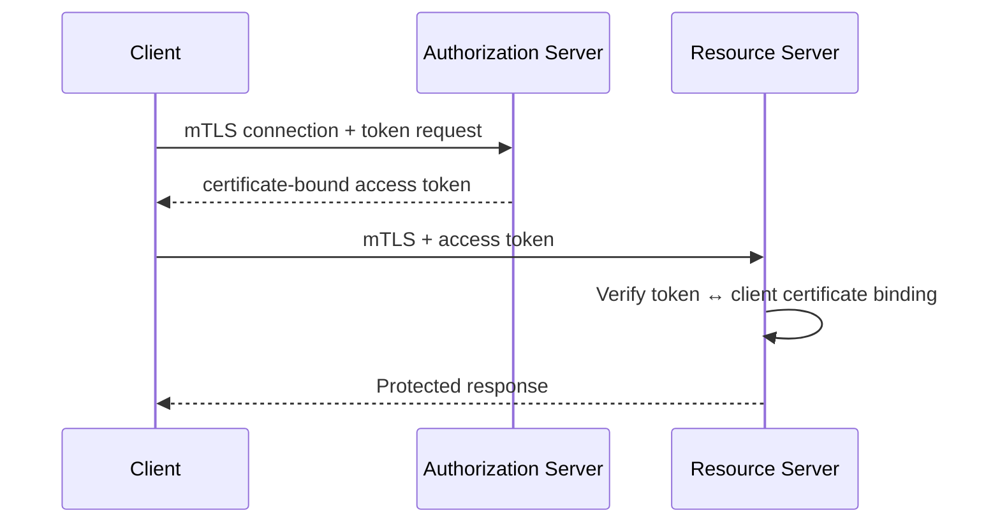

# 07 — Token Binding and Mutual TLS

> **Handbook standard:** This chapter is written as a practical engineering reference. It separates protocol semantics from implementation choices and highlights security implications.

## Learning objectives

- Explain the protocol concept in precise terminology.
- Trace the relevant HTTP messages and trust boundaries.
- Recognize implementation and security failure modes.
- Apply the concept in production-oriented designs.

## Practical mindset

OAuth is an authorization framework, not a login protocol by itself. Treat tokens as security credentials, minimize privilege, validate inputs at trust boundaries, and prefer current security best practices over legacy interoperability shortcuts.

## Sender-constrained tokens

Bearer tokens are usable by whoever possesses them. Sender-constrained tokens add a proof that the caller controls a particular key or certificate.

## Mutual TLS

RFC 8705 defines OAuth client authentication using mutual TLS and certificate-bound access tokens.

## DPoP

DPoP provides an application-layer proof-of-possession mechanism for OAuth tokens. The client signs a proof for each relevant request using a private key.

## When to use sender constraints

Consider them for high-value APIs, service-to-service environments, financial systems, or threat models where token replay is a significant risk.

## Operational costs

Certificate provisioning, key management, clock handling, proxy termination, and incident response become more complex. Security benefit must justify the operational burden.

## Standards and references

- [RFC 8705 — OAuth 2.0 Mutual TLS](https://www.rfc-editor.org/rfc/rfc8705.html)
- [RFC 9449 — OAuth 2.0 DPoP](https://www.rfc-editor.org/rfc/rfc9449.html)
- [RFC 9700](https://www.rfc-editor.org/rfc/rfc9700.html)

---

**Next:** Continue to the next chapter in this section.
