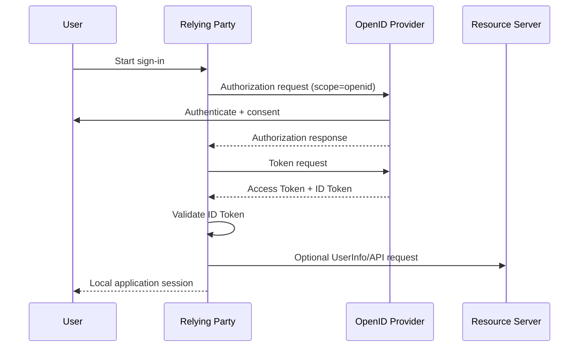

# 01 — What Is OpenID Connect?

## 1. The problem OIDC solves

OAuth 2.0 is fundamentally an authorization framework. It lets a client obtain delegated access to a protected resource. Applications also need a standardized way to answer: **who authenticated?**

OIDC adds that identity layer on top of OAuth 2.0 by defining authentication requests, ID Tokens, standardized claims, UserInfo, discovery, and registration metadata.

### Mental model

```text
OAuth 2.0  → delegated authorization
OIDC       → authentication + identity claims built on OAuth 2.0
```

## 2. Roles

| OIDC term            | Meaning                                            |
| -------------------- | -------------------------------------------------- |
| End-User             | Human being authenticated                          |
| Relying Party (RP)   | Application relying on OIDC identity               |
| OpenID Provider (OP) | OAuth authorization server that also provides OIDC |
| ID Token             | JWT containing authentication claims               |
| UserInfo Endpoint    | Protected endpoint for end-user claims             |

## 3. Authentication sequence



## 4. The `openid` scope

`scope=openid` signals that the client is making an OIDC authentication request. A request such as:

```http
GET /authorize?client_id=web-client&response_type=code&scope=openid%20profile%20email&state=...&nonce=...&code_challenge=...&code_challenge_method=S256
```

combines OAuth authorization with OIDC identity.

## 5. ID Token vs Access Token

| Artifact      | Primary purpose                     | Intended audience    |
| ------------- | ----------------------------------- | -------------------- |
| ID Token      | Authentication result for RP        | Client/RP            |
| Access Token  | Authorization to call protected API | Resource server      |
| Refresh Token | Obtain new access tokens            | Authorization server |

A common mistake is decoding an access token and treating its claims as the user's authenticated identity. The resource server's authorization semantics and the RP's authentication semantics are different trust boundaries.

## 6. `state` and `nonce`

They solve different problems:

```text
state → correlates the OAuth transaction / helps defend against CSRF
nonce → binds the OIDC authentication request to the returned ID Token
```

Both are commonly used in a secure OIDC login.

## 7. Why issuer and audience matter

A signed token can still be the **wrong** token. The RP must verify that:

- the issuer is the expected provider;
- the audience includes the RP's client ID;
- the signature comes from a trusted key;
- time and OIDC correlation claims are valid.

Cryptographic integrity does not replace semantic validation.

## 8. Local session boundary

After successful validation, the RP commonly creates its own application session:

```text
Provider identity assertion
        ↓ validate
Application account lookup / provisioning
        ↓
Secure local session
```

This limits the number of places where external bearer credentials need to remain exposed.

## 9. Common anti-pattern

### Unsafe mental model

```text
Receive JWT
→ decode payload
→ trust email
```

### Better model

```text
Authorization Code
→ token exchange
→ validate issuer/signature/audience/nonce/time
→ map (issuer, sub) to local identity
→ create local session
```

## 10. Production checklist

- Prefer Authorization Code + PKCE.
- Use HTTPS.
- Register exact redirect URIs.
- Generate and validate `state`.
- Generate and validate `nonce`.
- Validate issuer and audience.
- Validate the ID Token signature and claims.
- Never use an ID Token as a general API bearer credential.
- Do not log tokens or authorization codes.

## 11. Exercises

1. Explain in your own words why OAuth alone does not standardize user identity.
2. Draw a trust-boundary diagram for an RP, OP, browser, and API.
3. Implement a test that rejects a token with the wrong audience.

> **Handbook note**
>
> This chapter is written as an engineering reference. Examples are simplified; validate every security decision against the applicable standards and your system threat model.
