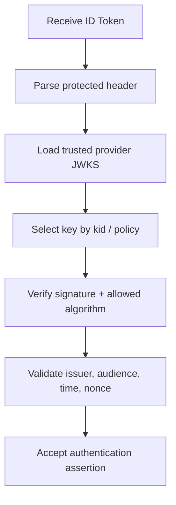

# 02 — ID Tokens and Claims

## 1. ID Token structure

An ID Token is a JWT with a signed JOSE structure:

```text
BASE64URL(header).BASE64URL(payload).BASE64URL(signature)
```

Example payload:

```json
{
  "iss": "https://idp.example.com",
  "sub": "248289761001",
  "aud": "client-123",
  "exp": 1790003600,
  "iat": 1790000000,
  "nonce": "random-transaction-value"
}
```

The payload is readable. Confidentiality is not provided merely because the JWT is signed.

## 2. Core claims

| Claim       | Meaning                  | Security check                              |
| ----------- | ------------------------ | ------------------------------------------- |
| `iss`       | Issuer                   | Exact trusted issuer                        |
| `sub`       | Subject identifier       | Stable provider-local identity key          |
| `aud`       | Audience                 | Must match intended client                  |
| `exp`       | Expiration               | Reject after policy-defined time            |
| `iat`       | Issued-at                | Apply timing policy / clock skew            |
| `auth_time` | Authentication time      | Relevant when re-authentication is required |
| `nonce`     | OIDC request correlation | Must match stored transaction when used     |
| `azp`       | Authorized party         | Validate when required by OIDC rules        |

## 3. Why `(issuer, sub)` matters

Do not assume email is a permanent primary key. A robust identity mapping often resembles:

```text
identity_key = (issuer, subject)
```

This avoids conflating identities that happen to share an email-like attribute.

## 4. Signature validation

Typical validation pipeline:



## 5. Algorithm policy

Never allow an untrusted JWT header to define an arbitrary algorithm policy. The application should have an explicit allowed-algorithm set based on provider configuration and library support.

## 6. Audience validation

A signature proves a trusted issuer signed the token. It does **not** prove that your application was the intended recipient. For example:

```json
{ "aud": ["other-client", "web-client"] }
```

The RP must confirm its own client ID is included and process `azp` consistently when applicable.

## 7. Time validation and clock skew

Distributed systems can have small clock differences. Define a bounded clock-skew policy rather than accepting arbitrarily old tokens.

Conceptually:

```text
now < exp + permitted_skew
```

The exact policy belongs in your security requirements.

## 8. Public vs pairwise subject identifiers

OIDC deployments can use subject identifier models with different privacy properties. Pairwise identifiers can reduce unnecessary cross-client correlation.

## 9. Required validation mindset

Before accepting an ID Token, answer:

```text
Who issued it?
Was the signature valid under a trusted key?
Was it intended for this client?
Is it temporally valid?
Does nonce match the transaction?
Does the identity map to the expected account?
```

## 10. Unit-test matrix

```text
valid
wrong issuer
wrong audience
expired
future iat beyond policy
wrong nonce
unknown kid
bad signature
disallowed algorithm
missing sub
```

Every negative case should have an explicit rejection path.

## 11. Practical rule

**Decoding is not validation.** A JWT decoder can turn base64url into JSON; it cannot, by itself, establish that the token is trusted and appropriate for the current login transaction.

> **Handbook note**
>
> This chapter is written as an engineering reference. Examples are simplified; validate every security decision against the applicable standards and your system threat model.
