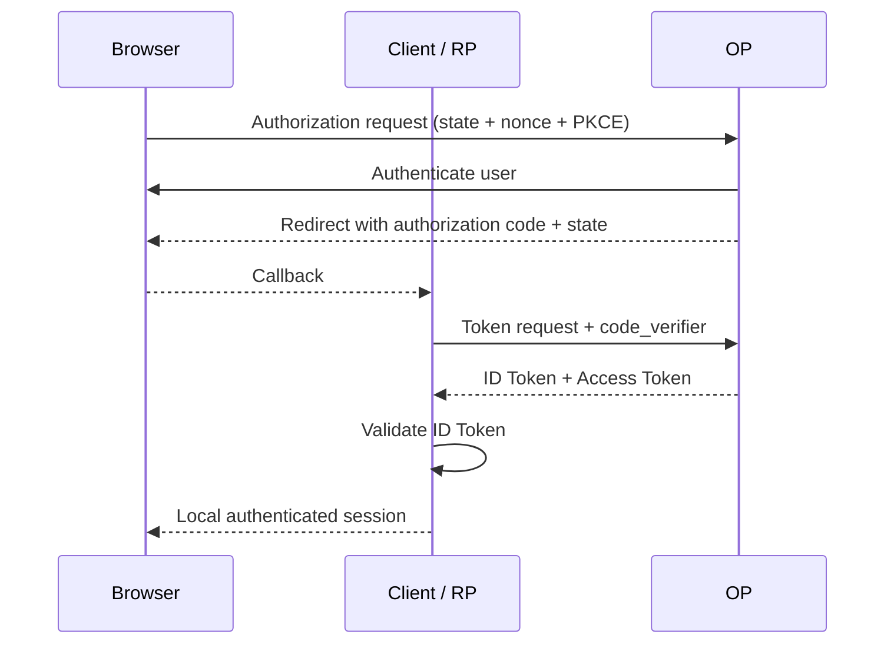

# 03 — OIDC Flows: Authorization Code, Implicit, and Hybrid

## 1. Modern default

For new interactive applications, start with **Authorization Code Flow + PKCE**. Current OAuth security guidance discourages relying on legacy Implicit-style browser token delivery for new designs.

## 2. Authorization Code Flow



### Why this is strong

- The authorization code is short-lived.
- PKCE binds redemption to the initiating transaction.
- Tokens can be kept away from the browser redirect channel in many architectures.

## 3. PKCE mechanics

```text
code_verifier = high-entropy random value
code_challenge = BASE64URL(SHA-256(code_verifier))
```

The challenge travels in the authorization request; the verifier travels during token exchange.

## 4. Implicit Flow — historical context

Implicit Flow historically delivered tokens through the authorization response. That increases exposure to front-channel browser handling. Modern deployments should generally migrate toward Authorization Code + PKCE rather than introduce new Implicit implementations.

## 5. Hybrid Flow

Hybrid Flow combines a code with one or more front-channel response artifacts. It exists in the OIDC ecosystem, but it increases the number of artifacts and correlation rules an implementation must secure. Use only when the deployment genuinely requires it.

## 6. Front-channel vs back-channel

```text
Front-channel → browser redirects, user-agent-visible data
Back-channel  → direct server-to-server HTTPS calls
```

Every additional front-channel artifact needs a clear reason and threat analysis.

## 7. `state` vs `nonce` vs PKCE

| Mechanism | Main purpose                                                             |
| --------- | ------------------------------------------------------------------------ |
| `state`   | Request/response correlation and CSRF defense                            |
| `nonce`   | OIDC authentication-response correlation                                 |
| PKCE      | Binds authorization-code redemption to the initiating client transaction |

They are complementary, not interchangeable.

## 8. Choosing a flow

| Application                       | Typical choice                                               |
| --------------------------------- | ------------------------------------------------------------ |
| Traditional server-rendered web   | Authorization Code                                           |
| SPA / browser-based public client | Authorization Code + PKCE                                    |
| Native mobile app                 | Authorization Code + PKCE with native-app practices          |
| Machine-to-machine                | OAuth client credentials; OIDC login is not normally needed  |
| Legacy integration                | Evaluate migration path before preserving old response types |

## 9. Migration exercise

Take a legacy Implicit integration and document:

1. new client registration
2. exact redirect URIs
3. Authorization Code + PKCE design
4. state/nonce transaction storage
5. ID Token validation
6. token storage changes
7. regression/security tests
8. decommission timeline

> **Handbook note**
>
> This chapter is written as an engineering reference. Examples are simplified; validate every security decision against the applicable standards and your system threat model.
