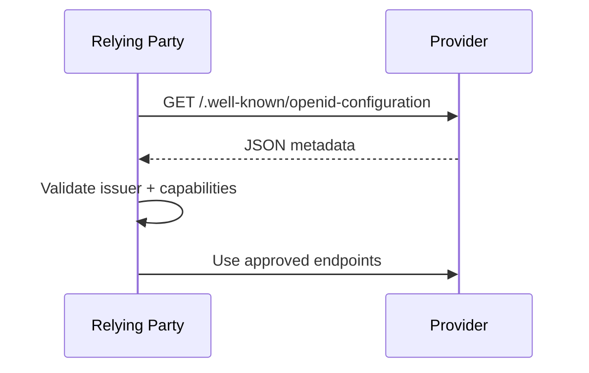

# 04 — Discovery and Dynamic Client Registration

## 1. Discovery

OIDC Discovery lets an RP obtain provider configuration rather than hard-code every endpoint. A common location is:

```text
https://idp.example.com/.well-known/openid-configuration
```

Example metadata:

```json
{
  "issuer": "https://idp.example.com",
  "authorization_endpoint": "https://idp.example.com/authorize",
  "token_endpoint": "https://idp.example.com/token",
  "userinfo_endpoint": "https://idp.example.com/userinfo",
  "jwks_uri": "https://idp.example.com/jwks.json",
  "response_types_supported": ["code"]
}
```

## 2. Why discovery is security-sensitive

Metadata controls where your application sends credentials, authorization requests, and token validation traffic. The first issuer selection must therefore be trusted and the returned `issuer` must be checked against the expected issuer identity.

## 3. Discovery sequence



## 4. Metadata to review

Common fields include:

- `issuer`
- `authorization_endpoint`
- `token_endpoint`
- `jwks_uri`
- `userinfo_endpoint`
- supported scopes / response types
- signing algorithms
- supported PKCE methods where relevant
- token endpoint authentication methods

## 5. Key rotation

Do not assume a provider has one permanent signing key. JWKS may contain multiple keys during rotation. Cache metadata and keys with bounded lifetime and refresh according to your provider strategy.

```text
unknown kid
   ↓
controlled JWKS refresh
   ↓
re-evaluate signature
```

Avoid turning every invalid token into an uncontrolled outbound network request.

## 6. Dynamic Client Registration

Dynamic registration lets an RP submit metadata such as redirect URIs and receive a client identifier/configuration.

```http
POST /connect/register
Content-Type: application/json

{
  "redirect_uris": ["https://app.example.com/callback"],
  "response_types": ["code"],
  "grant_types": ["authorization_code"]
}
```

## 7. Registration is an abuse surface

Unrestricted registration can enable:

- redirect URI abuse
- storage exhaustion
- client spam
- phishing infrastructure
- malicious metadata

Use registration policies, authentication, software statements, rate limits, and governance appropriate to the ecosystem.

## 8. SSRF consideration

Any feature that causes your server to fetch a URL supplied indirectly by a client deserves SSRF analysis. Use explicit network egress policies and robust URL validation.

## 9. Engineering exercise

Build a metadata loader with:

- configured issuer input
- secure discovery retrieval
- returned `issuer` validation
- bounded caching
- required-capability checks
- controlled JWKS refresh
- safe error logging

> **Handbook note**
>
> This chapter is written as an engineering reference. Examples are simplified; validate every security decision against the applicable standards and your system threat model.
