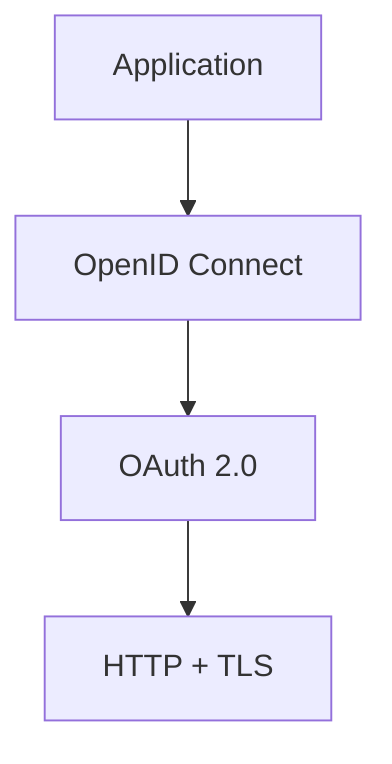

# 06 — OIDC vs OAuth 2.0

## 1. The simplest distinction

```text
OAuth 2.0 → authorization
OIDC      → authentication + identity
```

OAuth lets a client obtain access to a protected resource. OIDC defines a standardized identity layer on top of OAuth.

## 2. Example use cases

### OAuth

```text
Calendar app
→ user grants calendar.read
→ client receives access token
→ API returns calendar data
```

### OIDC

```text
Web application
→ user signs in with provider
→ RP receives ID Token
→ RP validates identity
→ RP creates local session
```

### Both

A SaaS application may use OIDC for login while using OAuth access tokens to call an API on behalf of the user.

## 3. Layering



## 4. Comparison

| Capability               | OAuth 2.0                  | OIDC         |
| ------------------------ | -------------------------- | ------------ |
| Authorization            | ✅                         | ✅ inherited |
| Authentication standard  | ❌                         | ✅           |
| ID Token                 | ❌                         | ✅           |
| Standard identity claims | ❌                         | ✅           |
| UserInfo                 | ❌ as an identity standard | ✅           |

## 5. Common misconceptions

**“An access token proves who the user is.”**

Not as a general rule; its audience and semantics are for resource authorization.

**“An ID Token is an API token.”**

No. Treat it as an RP authentication artifact unless a separate protocol explicitly says otherwise.

**“OAuth is the login protocol.”**

OAuth can be part of a login architecture, but OIDC provides the standardized identity semantics.

## 6. Design exercise

Classify each requirement as OAuth, OIDC, or both:

- sign in to a company account
- call a user's calendar API
- verify the authenticated subject
- request an API permission scope
- create a local app session

> **Handbook note**
>
> This chapter is written as an engineering reference. Examples are simplified; validate every security decision against the applicable standards and your system threat model.
