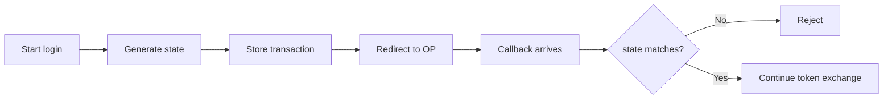

# 03 — CSRF and the `state` Parameter

## 1. Transaction correlation

A browser can have multiple authentication attempts in flight. The callback needs a way to prove which transaction it belongs to.



## 2. Properties of secure state

A state value should be unpredictable, unique per transaction, tied to the right browser/session context, single-use, and short-lived.

## 3. Opaque state is usually easier to reason about

Instead of embedding sensitive application state in the URL, use a random identifier and keep server-side transaction data such as `nonce`, PKCE challenge, and return path in protected storage.

## 4. Replay

A successfully consumed state value should not remain valid indefinitely. A simple model is:

```text
first callback → consume → accept
replayed callback → lookup missing/used → reject
```

## 5. State is not a secret container

It is primarily a transaction-binding value. It should not be used as an unprotected bag of user data.

## 6. State vs nonce

```text
state → OAuth request/response binding + CSRF defense
nonce → OIDC authentication assertion binding
```

Use both where your OIDC flow requires them.

## 7. Test cases

- missing state
- empty state
- wrong state
- reused state
- expired state
- state from another session
- valid state

> **Handbook note**
>
> This chapter is written as an engineering reference. Examples are simplified; validate every security decision against the applicable standards and your system threat model.
