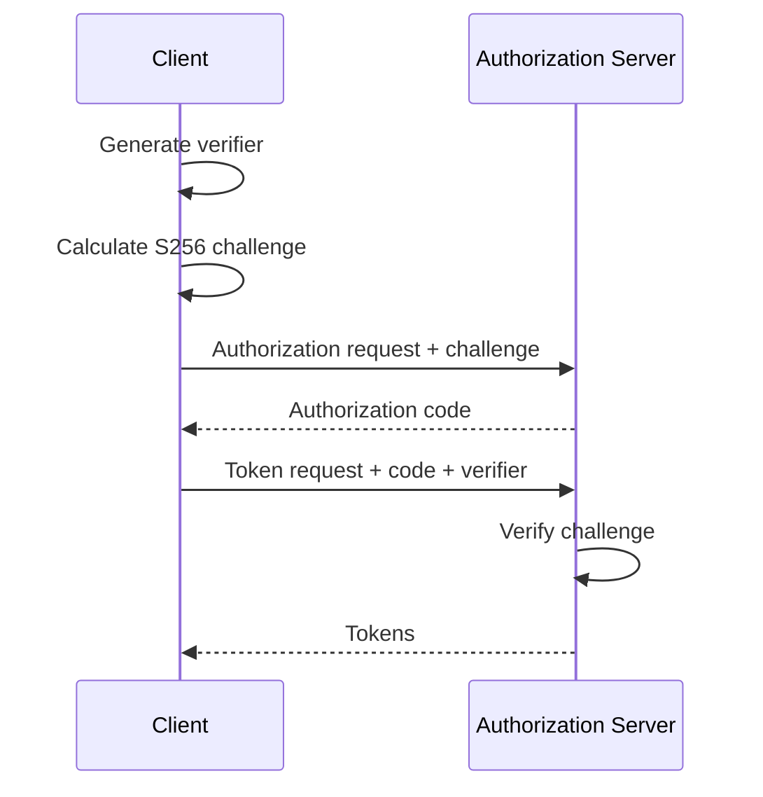

# 05 — PKCE and Why It Matters

## 1. Problem

An intercepted authorization code should not be enough to redeem tokens. PKCE binds a code exchange to a per-transaction verifier.

## 2. Core calculation

```text
code_verifier = high-entropy random value
code_challenge = BASE64URL(SHA-256(code_verifier))
```

The authorization request carries the challenge; the token request carries the verifier.

## 3. Sequence



## 4. PKCE is not a static client secret

A public client cannot keep a long-term secret confidential. PKCE instead gives each authorization transaction its own secret binding.

## 5. Implementation mistakes

- weak verifier randomness
- verifier reuse
- accepting missing PKCE when policy requires it
- incorrectly implementing Base64URL encoding
- confusing verifier and challenge
- not binding the verifier to the right transaction

## 6. Token endpoint checks

The token endpoint should verify that the authorization code is valid, unused, unexpired, issued to the expected client, associated with the correct transaction, and satisfies PKCE policy.

## 7. Exercise

Implement and test an S256 helper with altered verifier, altered challenge, invalid encoding, and repeated-use cases.

> **Handbook note**
>
> This chapter is written as an engineering reference. Examples are simplified; validate every security decision against the applicable standards and your system threat model.
