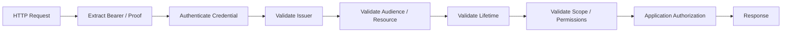

# 02 — Building a Resource Server

## 1. Responsibility

A resource server protects APIs. Its central question is:

> “Is this request authorized to access this resource?”

It should not blindly trust whichever token the client sends.

## 2. Request pipeline



## 3. Authentication vs authorization

Token validation establishes:

```text
who/what presented the credential
and
whether the credential is valid
```

Application authorization decides:

```text
can this principal perform THIS operation
on THIS resource
```

Do not confuse the two.

## 4. JWT access token validation

A resource server should define:

- trusted issuer
- accepted signing algorithms
- key source
- audience/resource
- clock-skew policy
- required claims
- accepted scope format

Example conceptual payload:

```json
{
  "iss": "https://idp.example.com",
  "sub": "user-42",
  "aud": "payments-api",
  "scope": "payments:read payments:write",
  "exp": 1790003600
}
```

## 5. Audience is a critical boundary

A token issued for:

```text
aud = profile-api
```

must not automatically become valid for:

```text
payments-api
```

Audience/resource validation is how services avoid accepting credentials intended for a different API.

## 6. Scope enforcement

Example:

```text
GET  /payments → payments:read
POST /payments → payments:write
DELETE /payments/42 → payments:delete
```

Scopes are necessary but may not be sufficient.

You may also need:

```text
tenant
owner
role
relationship
ABAC / RBAC policy
```

## 7. Sender-constrained tokens

For higher-risk systems, evaluate mTLS or DPoP to reduce replay of a stolen access token.

## 8. Introspection

If opaque tokens are used:

```text
API
 ↓
POST /introspect
 ↓
Authorization Server
 ↓
active / scope / client_id / sub / aud ...
```

Cache only according to the token and security policy.

## 9. Error behavior

Use appropriate OAuth / HTTP semantics while avoiding information disclosure.

Do not return stack traces or internal token-validation details to callers.

## 10. Observability

Record safe events such as:

```text
timestamp
request_id
client identifier
resource
authorization decision
failure category
```

Never log full bearer tokens.

## 11. Exercise

Protect an Express API with:

```text
GET /me
GET /orders
POST /orders
GET /admin/report
```

Test:

- missing token
- malformed token
- wrong audience
- expired token
- missing scope
- valid token
- cross-tenant access attempt
