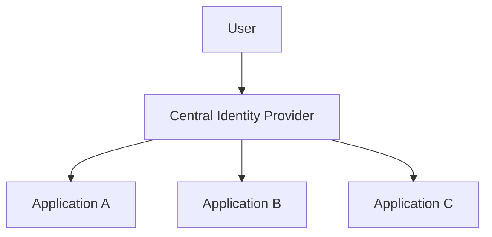

# 06 — Single Sign-On (SSO) Implementation

## 1. What SSO actually means

SSO means users can authenticate once within a trust ecosystem and access multiple applications
without separately authenticating at each application.

OIDC is commonly used for modern web identity federation.

## 2. Central identity architecture



Each application remains a separate relying party.

## 3. SSO session vs application session

These are different:

```text
Provider session
      ≠
Application A session
      ≠
Application B session
```

Deleting the application cookie does not necessarily terminate the provider session.

## 4. Login sequence

```text
User visits App A
→ App A redirects to IdP
→ IdP session already exists
→ IdP returns authorization result
→ App A creates local session

Later:
User visits App B
→ App B redirects to IdP
→ IdP sees existing session
→ no new credential challenge
→ App B creates local session
```

## 5. Logout design

Logout can mean:

```text
local logout
provider logout
front-channel coordination
back-channel session notification
token revocation
```

Choose intentionally.

## 6. Multi-application trust

Document:

- issuer
- client registrations
- allowed redirects
- session duration
- re-authentication requirements
- claims
- tenant boundaries
- administrator controls

## 7. SSO security pitfalls

- trusting email without verified semantics
- account linking without sufficient proof
- accepting wrong issuer
- using broad redirect URIs
- sharing client secrets between applications
- assuming logout is global by default
- over-sharing identity claims

## 8. Exercise

Design SSO for:

```text
customer portal
admin portal
billing portal
internal support portal
```

Decide which clients are public/confidential, which claims each needs, how sessions are isolated, and
how emergency account disablement propagates.
