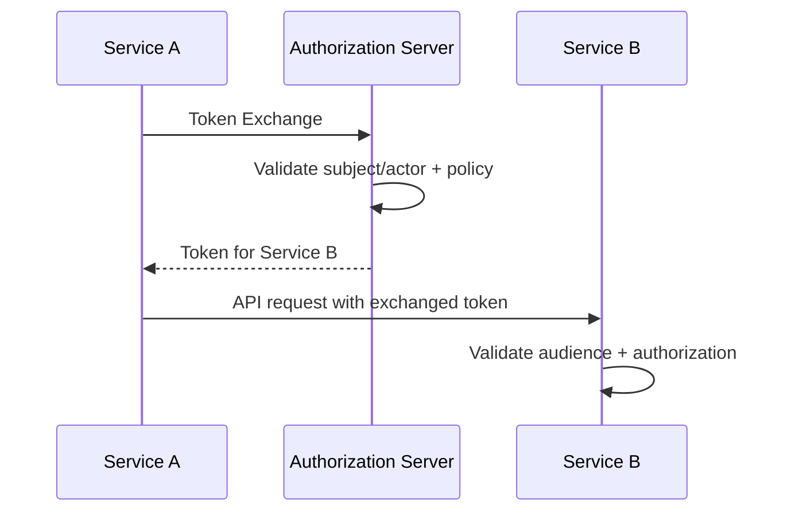

# 01 — Token Exchange and Delegation

## 1. Why token exchange exists

A system often receives a credential that should not be passed unchanged to another service.

Example:

```text
User Token
   ↓
API Gateway
   ↓
Service A
   ↓
Service B
```

Service A may exchange the incoming security context for a token specifically intended for Service B.

RFC 8693 defines a token exchange framework for this class of use case.

## 2. Conceptual request

```http
POST /token
Content-Type: application/x-www-form-urlencoded

grant_type=urn:ietf:params:oauth:grant-type:token-exchange&
subject_token=...&
subject_token_type=urn:ietf:params:oauth:token-type:access_token&
audience=service-b
```

Exact parameters depend on the exchange design.

## 3. Delegation vs impersonation

These are not the same.

### Impersonation

Service acts as if it were the subject:

```text
actor = service-A
subject = user-42
```

### Delegation

The token can preserve both:

```text
subject = user-42
actor = service-A
```

This distinction matters for auditing and authorization.

## 4. Audience restriction

One of the strongest reasons for exchange is to produce a token with a narrower audience:

```text
incoming token → broad
exchanged token → service-b only
```

This reduces blast radius.

## 5. Architecture



## 6. Security considerations

Validate:

- token type
- issuer
- subject-token audience
- allowed caller
- requested audience/resource
- actor permissions
- delegation policy
- requested scope
- lifetime

Never turn token exchange into a generic “make any token for any service” endpoint.

## 7. Exercise

Design an exchange chain:

```text
Frontend user
→ API Gateway
→ Orders
→ Payments
```

Ensure Payments receives only the permissions required for the payment operation.
