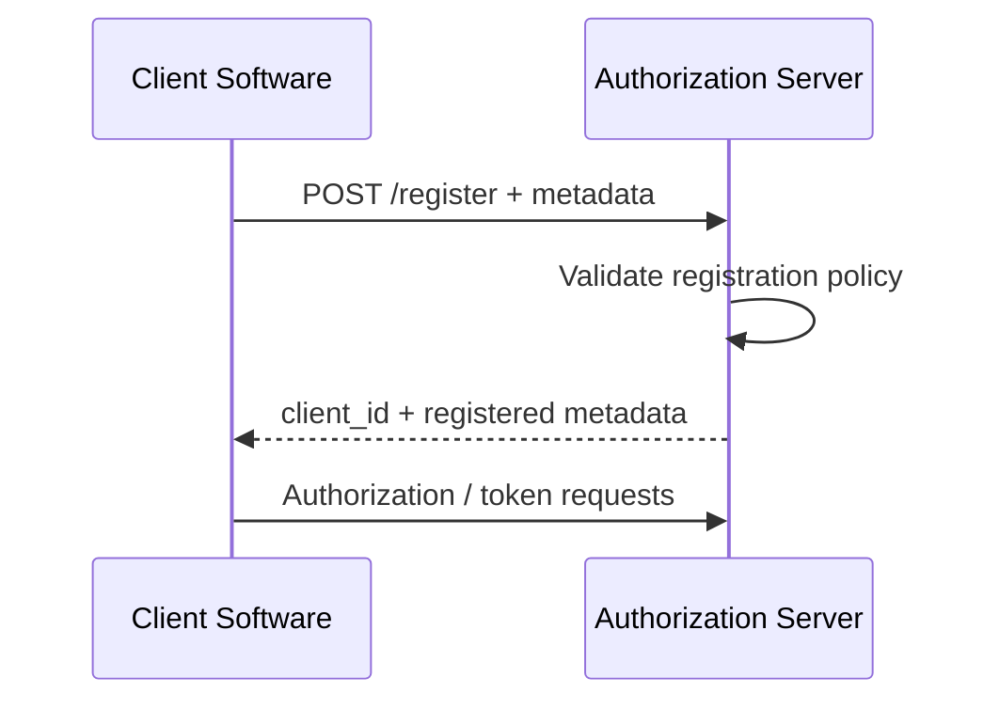

# 02 — Dynamic Client Registration

## 1. What it solves

Dynamic registration enables software to request OAuth client registration programmatically.

RFC 7591 defines the registration protocol and metadata model.

## 2. Registration flow



## 3. Registration metadata

Potential metadata includes:

```text
redirect_uris
response_types
grant_types
token_endpoint_auth_method
client_name
scope
logo_uri
contacts
```

The accepted fields depend on the ecosystem.

## 4. Registration security

A registration endpoint can become an abuse surface.

Consider:

- who may register
- rate limits
- software statements
- redirect URI restrictions
- client approval workflows
- client lifecycle
- secret/key provisioning
- de-registration

## 5. Redirect URI is still critical

Dynamic registration does not remove redirect URI security.

A malicious registration like:

```text
https://attacker.example/callback
```

can be dangerous if an attacker can freely create clients in a trusted ecosystem.

## 6. Lifecycle

Treat registration as an identity lifecycle:

```text
request
→ validate
→ approve
→ issue identifier
→ provision credential
→ rotate
→ suspend
→ de-register
```

## 7. Exercise

Design registration policy for a developer platform where only verified applications may register.

Document what evidence is required and what redirect URIs are permitted.
