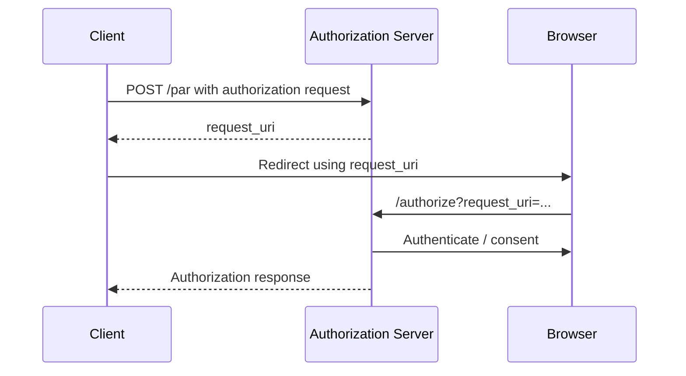

# 04 — Pushed Authorization Requests (PAR)

## 1. Why PAR exists

Normal OAuth authorization requests travel through the user's browser, often in a URL.

PAR (RFC 9126) lets the client first POST the request directly to the authorization server.

## 2. Flow



## 3. Benefits

PAR helps:

- keep large authorization requests out of browser URLs
- bind request construction to the authenticated client
- support high-assurance profiles
- combine naturally with RAR and JAR

## 4. Security model

The PAR endpoint must authenticate / authorize the client according to deployment policy.

The resulting `request_uri` should be:

- short-lived
- single-use or appropriately constrained
- bound to the originating client
- not treated as a permanent secret

## 5. Example

```http
POST /par
Authorization: Basic ...
Content-Type: application/x-www-form-urlencoded

client_id=client-123&
response_type=code&
redirect_uri=https%3A%2F%2Fapp.example.com%2Fcb&
scope=openid&
code_challenge=...&
code_challenge_method=S256
```

Response:

```json
{
  "request_uri": "urn:example:request_uri:abc123",
  "expires_in": 60
}
```

## 6. Exercise

Convert a traditional authorization request containing RAR data into a PAR-based flow and define
what is authenticated at the PAR endpoint.
