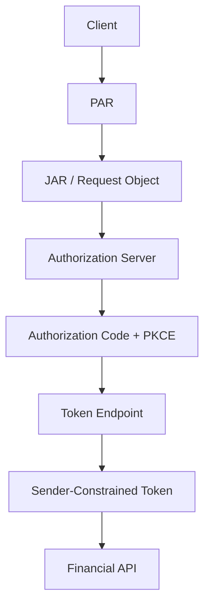

# 09 — OAuth 2.0 and FAPI (Financial-grade API)

## 1. Why FAPI exists

Financial APIs have a higher assurance bar than ordinary consumer integrations.

FAPI profiles combine OAuth/OIDC security mechanisms into a more restrictive deployment profile.

The design goal is not “more OAuth features”; it is stronger security properties and interoperability
for high-value transactions.

## 2. Typical high-assurance controls

Depending on the FAPI profile and ecosystem, expect stronger requirements around:

```text
sender-constrained tokens
strong client authentication
request object integrity
PAR
strict redirect handling
strong cryptography
audience / issuer validation
transaction integrity
```

## 3. Layered architecture



## 4. PAR + JAR

For high-assurance use cases, PAR and JAR can work together:

```text
JAR → integrity / source-authenticated request object
PAR → back-channel delivery of the authorization request
```

This reduces dependence on an unprotected browser URL for sensitive request parameters.

## 5. Sender constraint

Evaluate:

- mTLS
- DPoP

for reducing replay of stolen access tokens.

## 6. Transaction integrity

For a financial action, authenticating the user is not necessarily enough.

The system may need to prove that the user approved the transaction details that were actually executed.

That can require:

```text
amount
payee
currency
transaction identifier
transaction state
```

to remain integrity-protected across the authorization journey.

## 7. Operational maturity

High-assurance authorization requires:

- key rotation
- incident response
- fraud monitoring
- audit events
- strict client onboarding
- environment isolation
- security testing
- dependency management

## 8. Exercise

Design a high-assurance payment authorization flow with:

```text
OIDC login
PAR
JAR
PKCE
mTLS or DPoP
RAR payment details
```

Document:

1. every credential
2. every trust boundary
3. every cryptographic proof
4. every place replay can occur
5. every negative test
