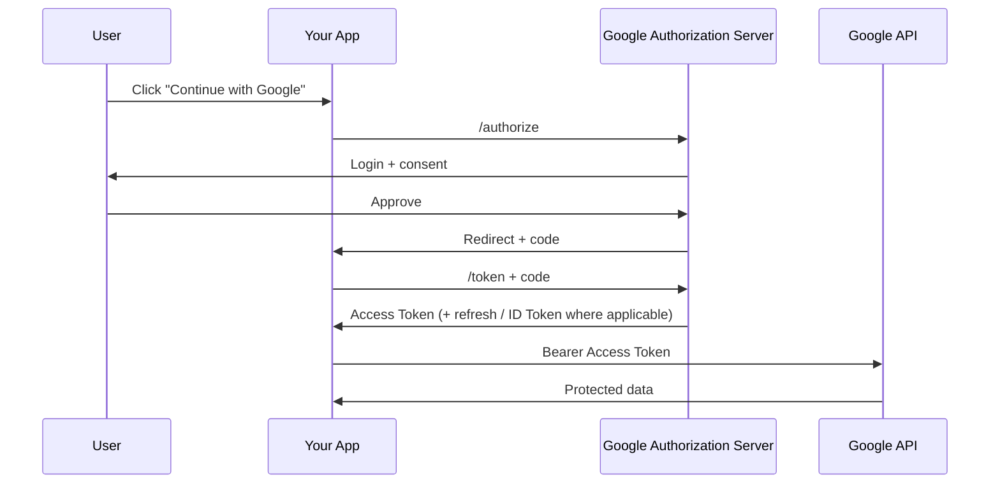

# 01 — Google OAuth 2.0 Setup

Google provides OAuth 2.0 authorization for applications that need delegated access to Google APIs. Google documents a web-server flow in which the application redirects the user, receives an authorization code, exchanges it for tokens, and then calls APIs with the access token. citeturn143287search8

## 1. Architecture



## 2. Register the application

Conceptually configure:

```text
Application type
Client ID
Client secret (for confidential clients)
Authorized redirect URI(s)
Scopes
```

Keep environment-specific configuration separate:

```text
development
staging
production
```

Do not casually reuse a production client configuration for local testing.

## 3. Authorization request

Example shape:

```text
https://accounts.google.com/o/oauth2/v2/auth
  ?client_id=...
  &redirect_uri=https%3A%2F%2Fapp.example.com%2Foauth%2Fgoogle%2Fcallback
  &response_type=code
  &scope=openid%20email%20profile
  &state=...
  &nonce=...
  &code_challenge=...
  &code_challenge_method=S256
```

The precise scopes and parameters depend on whether you are using Google APIs, OIDC sign-in, or both.

## 4. Token exchange

Conceptually:

```http
POST /token
Content-Type: application/x-www-form-urlencoded

code=...
&client_id=...
&client_secret=...
&redirect_uri=...
&grant_type=authorization_code
&code_verifier=...
```

Do not expose `client_secret` in browser JavaScript.

## 5. Identity vs API access

For sign-in:

```text
OIDC
  -> ID Token
  -> validate issuer/audience/nonce/etc.
```

For Google API access:

```text
OAuth
  -> Access Token
  -> call intended API
```

Do not treat an API Access Token as a generic user profile assertion.

## 6. Scope design

Avoid broad scopes when a narrower scope satisfies the feature.

Document:

```text
Feature
  -> required Google API
  -> required scope
  -> why the scope is needed
```

## 7. Refresh tokens and offline access

When the application's architecture needs long-term delegated access, carefully design refresh-token handling.

Store refresh credentials like high-value secrets:

```text
encrypted-at-rest
server-side
access-controlled
never logged
rotatable / revocable
```

## 8. Cross-account protection

A strong integration should not accidentally associate one local user with a different Google account.

Bind the identity to validated provider identity information and your login transaction.

## 9. Failure cases

Test:

```text
access_denied
invalid_grant
redirect_uri_mismatch
expired authorization code
wrong PKCE verifier
unexpected issuer
wrong audience
user changes Google account
```

## 10. Practical Node.js exercise

Build:

```text
GET /auth/google
GET /auth/google/callback
GET /me
POST /logout
```

Requirements:

- state validation,
- PKCE,
- OIDC validation when using Google Sign-In,
- no token logging,
- secure local session,
- provider error handling.

Google's current web-server documentation explicitly covers scopes, access/refresh tokens, redirect URIs, revocation, and cross-account protection. citeturn143287search8
