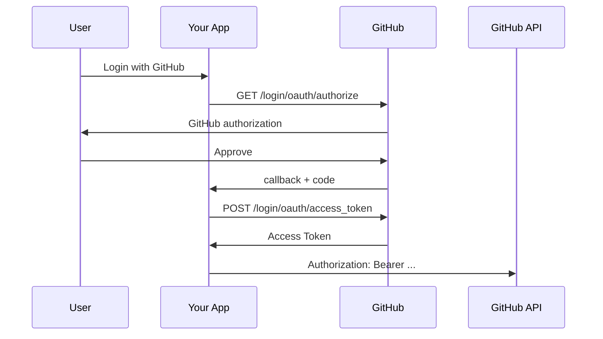

# 02 — GitHub OAuth 2.0 Setup

GitHub supports OAuth Apps and also provides GitHub Apps. GitHub currently recommends considering GitHub Apps for many integrations because they support fine-grained permissions and short-lived tokens. citeturn143287search7turn143287search9

## 1. First decision: OAuth App or GitHub App?

Use an OAuth App when:

```text
You specifically need classic OAuth user authorization behavior.
```

Consider a GitHub App when:

```text
You need fine-grained permissions,
repository-level control,
short-lived tokens,
or app-identity based automation.
```

GitHub's documentation explicitly encourages considering GitHub Apps instead of OAuth Apps for many new integrations. citeturn143287search7

## 2. OAuth App flow



GitHub documents the authorization endpoint, token endpoint, scopes, redirect URL, and API usage for OAuth Apps. citeturn143287search4

## 3. Example authorization URL

```text
https://github.com/login/oauth/authorize
  ?client_id=...
  &redirect_uri=https%3A%2F%2Fapp.example.com%2Foauth%2Fgithub%2Fcallback
  &scope=read%3Auser%20user%3Aemail
  &state=...
```

Request only the scopes your feature requires.

## 4. User identity

After obtaining an Access Token, retrieve the GitHub user identity through the documented API.

GitHub specifically notes that applications should revalidate the user's identity whenever they receive an access token because the user account could change during authorization. citeturn143287search4

This is especially important when implementing:

```text
account linking
login
session creation
```

## 5. Token models

GitHub supports expiring access tokens for OAuth Apps. When configured, a refresh token and expiration information can accompany the Access Token. citeturn143287search4

Never assume:

```text
GitHub token = forever token
```

Inspect the returned token response and provider documentation.

## 6. Scopes

GitHub scopes represent groups of permissions. They limit the token's capabilities but do not grant more authority than the owner already has. citeturn143287search1turn143287search7

Prefer:

```text
user:email
read:user
```

when those are enough, rather than asking for broad repository write permissions.

## 7. Provider-specific concerns

Test:

```text
organization approval
scope changes
user denies access
user authorizes a different account
expired token
revoked authorization
rate limiting
API permission mismatch
```

## 8. Practical project

Build:

```text
GET /auth/github
GET /auth/github/callback
GET /github/profile
GET /github/repos
```

Then document:

```text
OAuth App limitations
GitHub App alternative
requested scopes
identity mapping
token lifecycle
```

GitHub itself recommends regularly reviewing and removing unused authorized integrations. citeturn143287search1
