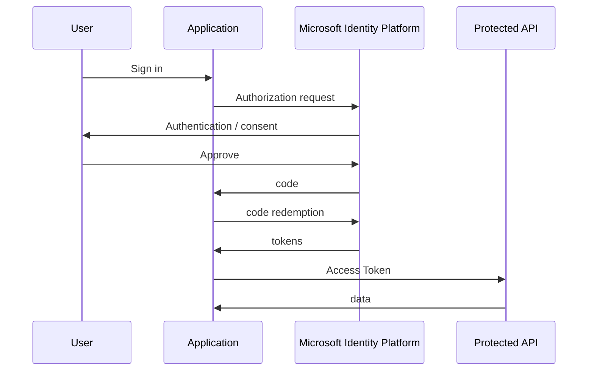

# 04 — Microsoft Identity Platform OAuth 2.0

Microsoft's identity platform supports OAuth 2.0 Authorization Code flow for applications accessing protected resources. Microsoft documents the authorization request, code redemption, API use, refresh, and SPA redirect considerations. citeturn145506search5

## 1. Terminology

Microsoft identity platform integrations commonly involve:

```text
Microsoft Entra ID / identity platform
Tenant
Application registration
Client ID
Client secret / certificate
Scopes
Permissions
Access Token
ID Token for OIDC
```

## 2. High-level flow



## 3. Tenant strategy

Choose deliberately:

```text
single-tenant
multi-tenant
consumer / supported account types
```

Do not accept arbitrary issuers merely because your application is “multi-tenant”.

Your token validation and issuer model must match the tenant architecture.

## 4. Authorization URL

Conceptually:

```text
https://login.microsoftonline.com/{tenant}/oauth2/v2.0/authorize
  ?client_id=...
  &response_type=code
  &redirect_uri=...
  &scope=...
  &state=...
  &code_challenge=...
  &code_challenge_method=S256
```

The exact endpoint and tenant path depend on the application model.

## 5. Token redemption

Conceptually:

```http
POST /oauth2/v2.0/token

grant_type=authorization_code
code=...
redirect_uri=...
client_id=...
code_verifier=...
client_secret=...
```

Confidential credentials remain server-side.

## 6. API audience

One of the most important concepts is:

```text
Token intended for API A
!=
token intended for API B
```

Your API should validate the correct issuer and audience rather than accepting any Microsoft-issued token.

## 7. SPA and native apps

Public clients have different credential constraints. Use the provider-supported Authorization Code + PKCE model where appropriate.

Microsoft specifically documents SPA redirect URI considerations in its Authorization Code flow guidance. citeturn145506search5

## 8. Practical lab

Build a tenant-aware login service:

```text
GET /auth/microsoft
GET /auth/microsoft/callback
GET /me
```

Add tests for:

```text
correct tenant
unexpected tenant
wrong audience
expired token
wrong issuer
wrong state
wrong PKCE verifier
```
